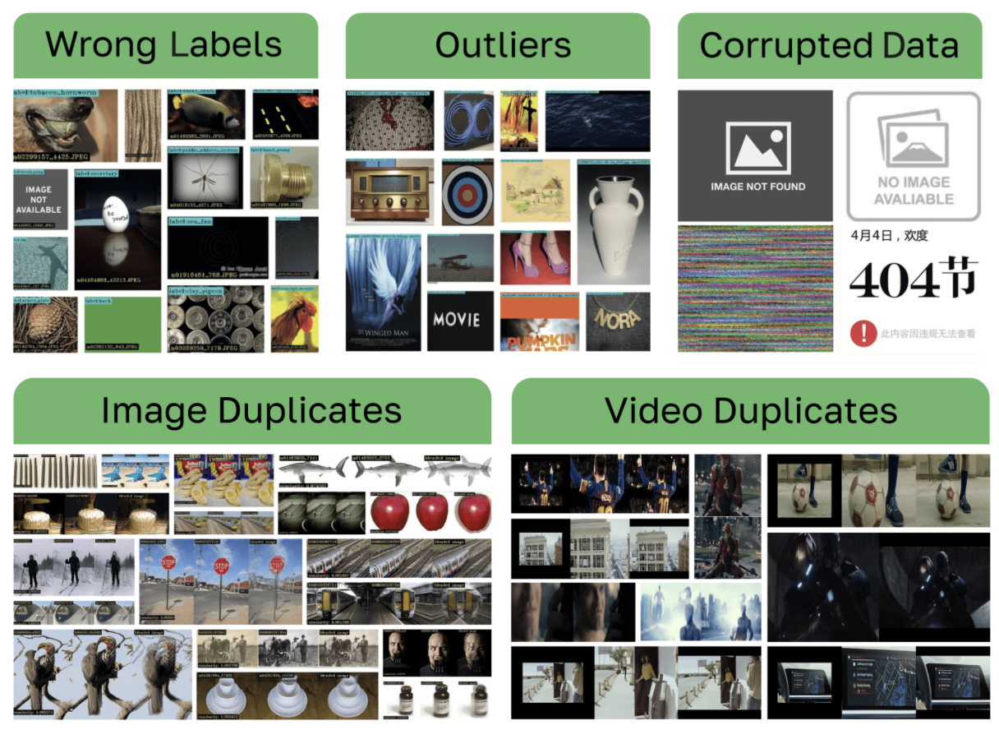
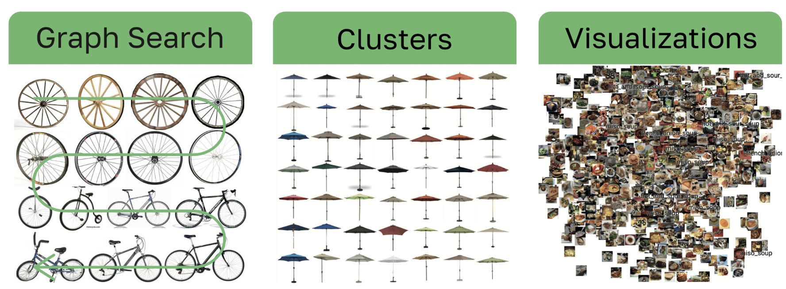
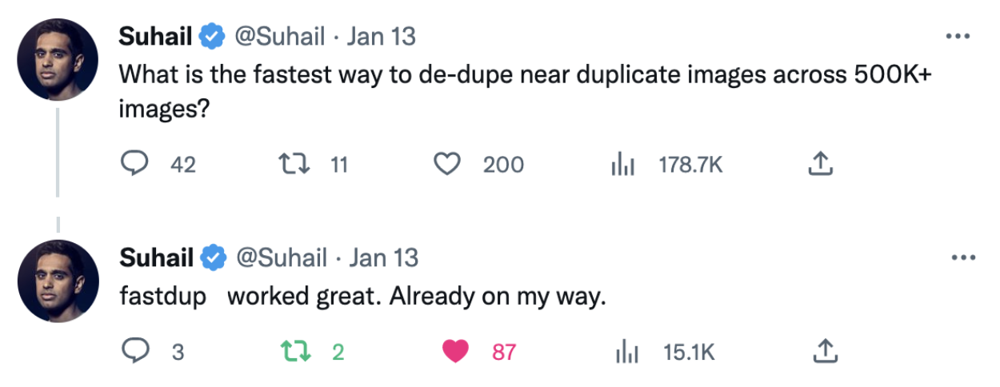

<!-- PROJECT SHIELDS -->
<!--
*** I'm using markdown "reference style" links for readability.
*** Reference links are enclosed in brackets [ ] instead of parentheses ( ).
*** See the bottom of this document for the declaration of the reference variables
*** for contributors-url, forks-url, etc. This is an optional, concise syntax you may use.
*** https://www.markdownguide.org/basic-syntax/#reference-style-links
-->

[![PyPi][pypi-shield]][pypi-url]
[![PyPi][pypiversion-shield]][pypi-url]
[![PyPi][downloads-shield]][downloads-url]
[![Contributors][contributors-shield]][contributors-url]
[![License][license-shield]][license-url]

<!-- MARKDOWN LINKS & IMAGES -->
<!-- https://www.markdownguide.org/basic-syntax/#reference-style-links -->
[pypi-shield]: https://img.shields.io/badge/Python-3.7%20|%203.8%20|%203.9%20|%203.10-blue?style=for-the-badge
[pypi-url]: https://pypi.org/project/fastdup/
[pypiversion-shield]: https://img.shields.io/pypi/v/fastdup?style=for-the-badge
[downloads-shield]: https://img.shields.io/badge/dynamic/json?style=for-the-badge&label=downloads&query=%24.total_downloads&url=https%3A%2F%2Fapi.pepy.tech%2Fapi%2Fprojects%2Ffastdup&color=lightblue
[downloads-url]: https://pypi.org/project/fastdup/
[contributors-shield]: https://img.shields.io/github/contributors/visual-layer/fastdup?style=for-the-badge
[contributors-url]: https://github.com/othneildrew/Best-README-Template/graphs/contributors
[license-shield]: https://img.shields.io/badge/License-CC%20BY%204.0-purple.svg?style=for-the-badge
[license-url]: https://github.com/visual-layer/fastdup/blob/main/LICENSE

<!-- PROJECT LOGO -->
<br />
<div align="center">
  <a href="https://www.visual-layer.com">
    
  </a>

<h3 align="center">Manage, Clean & Curate Visual Data - Fast and at Scale</h3>

  <p align="center">
  An unsupervised and free tool for image and video dataset analysis.
    <br />
    <a href="https://visual-layer.readme.io/"><strong>Explore the docs »</strong></a>
    <br />
    <a href="https://visual-layer.readme.io/">Features</a>
    ·
    <a href="https://github.com/visual-layer/fastdup/issues">Report Bug</a>
    ·
    <a href="https://medium.com/@amiralush/large-image-datasets-today-are-a-mess-e3ea4c9e8d22">Read Blog</a>
    ·
    <a href="https://visual-layer.readme.io/docs/getting-started">Quickstart</a>
    ·
    <a href="https://visual-layer.com/">Enterprise Edition</a>
    ·
    <a href="https://visual-layer.com/">About us</a>
    <br />
    <br /> 
    <a href="https://visualdatabase.slack.com/join/shared_invite/zt-19jaydbjn-lNDEDkgvSI1QwbTXSY6dlA#/shared-invite/email">
    
    </a>
    <a href="https://visual-layer.readme.io/discuss">
    
    </a>
    <a href="https://www.linkedin.com/company/visual-layer/">
    
    </a>
    <a href="https://www.youtube.com/@visual-layer4035">
    
    </a>
  </p>
  <br />
    🔥 We've released fastdup V1.0! View the release notes
    <a href="./RELEASE_NOTES.md">here</a>.
    <br />
</div>

## What's Included
fastdup lets you identify -
 <div align="center" style="display:flex;flex-direction:column;">
  <a href="https://www.visual-layer.com">
    
  </a>
 </div>

Additional features -

<div align="center" style="display:flex;flex-direction:column;">
  <a href="https://www.visual-layer.com">
    
  </a>
 </div>


## Why fastdup?

- **Quality**: Find and remove anomalies and outliers from your dataset, including duplicates and similar images and videos at a large scale.
- **Cost**: Reduce data operation costs by intelligently sampling high-quality or novel datasets before labeling and assessing labeled data quality.
- **Scale**: fastdup's C++ graph engine is highly efficient and can handle up to 400M images on a single CPU machine.


## Setting up

### Prerequisites 

> **Note** - Supported `Python` versions:

[![PyPi][pypi-shield]][pypi-url]

> **Note** - Supported operating systems:

[](https://visual-layer.readme.io/docs/installation#winnative)
[](https://visual-layer.readme.io/docs/installation#winnative)
[](https://visual-layer.readme.io/docs/installation#winnative)
[](https://visual-layer.readme.io/docs/installation#winnative)
[](https://visual-layer.readme.io/docs/installation#ubuntu-20041804-lts-machine-setup-a-nameubuntua)
[](https://visual-layer.readme.io/docs/installation#ubuntu-20041804-lts-machine-setup-a-nameubuntua)
[-000000?style=for-the-badge&logo=apple&logoColor=white)](https://visual-layer.readme.io/docs/installation#mac-os-setup-a-namemacosxa)
[-000000?style=for-the-badge&logo=apple&logoColor=white)](https://visual-layer.readme.io/docs/installation#mac-os-setup-a-namemacosxa)
[](https://visual-layer.readme.io/docs/installation#amazon-linux-2-setup-a-nameamazon_linuxa)
[](https://visual-layer.readme.io/docs/installation#centos-7-setup--amazon-linux-2--redhat-48-a-namecentos7a)
[](https://visual-layer.readme.io/docs/installation#centos-7-setup--amazon-linux-2--redhat-48-a-namecentos7a) 

Detailed installation instructions and common errors [here](https://visual-layer.readme.io/docs/installation).

### Installation

```python
# upgrade pip to its latest version
pip install -U pip

# install fastdup
pip install fastdup
    
# Alternatively, use explicit python version (XX)
python3.XX -m pip install fastdup 
```


## Getting Started

Run fastdup with only 3 lines of code.


Visualize the result.


Here are the 7 lines of code you'll need in most cases.

```python
import fastdup

fd = fastdup.create(work_dir, images_dir)
fd.run(nearest_neighbors_k=5, cc_threshold=0.96)

fd.vis.duplicates_gallery()     # create a visual gallery of found duplicates
fd.vis.outliers_gallery()       # create a visual gallery of anomalies
fd.vis.component_gallery()     # create a visualization of connected components
fd.vis.stats_gallery()          # create a visualization of images statistics (for example blur)
```

## Learn from Examples

<table>
  <tr>
      <td rowspan="3" width="160">
      <a href="https://visual-layer.readme.io/docs/getting-started">
              
      </a>
      </td>    
      <td rowspan="3">
        <b>Quick dataset analysis:</b> In this tutorial, the Oxford-IIIT Pet Dataset is used to demonstrate how to visualize similarity clusters, find duplicates and outliers in the dataset, and analyze the images in each cluster.
      </td>
      <td align="center" width="80">
          <a href="https://nbviewer.org/github/visual-layer/fastdup/blob/main/examples/quick_dataset_analysis.ipynb">
              
          </a>
      </td>
  </tr>
  <tr>
      <td align="center">
          <a href="https://github.com/visual-layer/fastdup/blob/main/examples/quick_dataset_analysis.ipynb">
              
          </a>
      </td>
  </tr>
  <tr>
      <td align="center">
          <a href="https://colab.research.google.com/drive/18gbpq8A62KAjJolCuRnOAmJCRGT1Vu1J#scrollTo=pN6wiKBax7Pa">
              
          </a>
      </td>
  </tr>

  <!-- ------------------------------------------------------------------- -->

  <tr>
      <td rowspan="3" width="160">
      <a href="https://visual-layer.readme.io/docs/abc">
              
      </a>
      </td>    
      <td rowspan="3">
        <b>Cleaning and preparing a dataset:</b> In this tutorial, we use fastdup to clean and analyze a food-101 dataset. The cleaning process includes identifying and removing duplicates, broken images, outliers, as well as the darkest, brightest, and blurriest images. FastDup also analyzes the dataset, finding similarity clusters and the percentage of images that fall within these clusters.
      </td>
      <td align="center" width="80">
          <a href="https://nbviewer.org/github/visual-layer/fastdup/blob/main/examples/cleaning_and_preparing_an_image_dataset.ipynb">
              
          </a>
      </td>
  </tr>
  <tr>
      <td align="center">
          <a href="https://github.com/visual-layer/fastdup/blob/main/examples/cleaning_and_preparing_an_image_dataset.ipynb">
              
          </a>
      </td>
  </tr>
  <tr>
      <td align="center">
          <a href="https://colab.research.google.com/drive/1NBTD_Z5beSlumQOqDPdF2UzrhdEf0uxC">
              
          </a>
      </td>
  </tr>

  <!-- ------------------------------------------------------------------- -->

  <tr>
      <td rowspan="3" width="160">
      <a href="https://visual-layer.readme.io/docs/analyzing-labeled-images">
              
      </a>
      </td>    
      <td rowspan="3">
        <b>Preparing an image dataset for training:</b> In this tutorial, we analyze the Imagenette dataset, a 10-class, 13k image subset of ImageNet. In this tutorial, we show how to use fastdup to analyze the dataset for similarity and outlier images.
      </td>
      <td align="center" width="80">
          <a href="https://nbviewer.org/github/visual-layer/fastdup/blob/main/examples/preparing_a_labeled_image_dataset_for_training.ipynb">
              
          </a>
      </td>
  </tr>
  <tr>
      <td align="center">
          <a href="https://github.com/visual-layer/fastdup/blob/main/examples/preparing_a_labeled_image_dataset_for_training.ipynb">
              
          </a>
      </td>
  </tr>
  <tr>
      <td align="center">
          <a href="https://colab.research.google.com/drive/1LMbwD5QcXqqk8HSGfHu8m5o5KvG7MfGc">
              
          </a>
      </td>
  </tr>

  <!-- ------------------------------------------------------------------- -->

  <tr>
      <td rowspan="3" width="160">
      <a href="https://visual-layer.readme.io/docs/objects-and-bounding-boxes">
              
      </a>
      </td>    
      <td rowspan="3">
        <b>Preparing an object dataset for training:</b> In this tutorial we will load and analyze the mini-coco dataset which is labeled with bounding boxes and classes. Using fastdup, we discover duplicates, outliers, and possible mislabeled bounding boxes.
      </td>
      <td align="center" width="80">
          <a href="https://nbviewer.org/github/visual-layer/fastdup/blob/main/examples/preparing_a_labeled_object_dataset_for_training.ipynb">
              
          </a>
      </td>
  </tr>
  <tr>
      <td align="center">
          <a href="https://github.com/visual-layer/fastdup/blob/main/examples/preparing_a_labeled_object_dataset_for_training.ipynb">
              
          </a>
      </td>
  </tr>
  <tr>
      <td align="center">
          <a href="https://colab.research.google.com/drive/1MwxalEbILkSUt3NXZRhc9bWjfIGFbC6p">
              
          </a>
      </td>
  </tr>

  <!-- ------------------------------------------------------------------- -->
  
</table>


## Getting Help
Get help from the fastdup team or community members via the following channels -
+ [Slack](https://visualdatabase.slack.com/join/shared_invite/zt-19jaydbjn-lNDEDkgvSI1QwbTXSY6dlA#/shared-invite/email).
+ GitHub [issues](https://github.com/visual-layer/fastdup/issues).
+ Discussion [forum](https://visual-layer.readme.io/discuss).

## Community Contributions
The following are community-contributed blog posts about fastdup - 

- [Master Data Integrity to Clean Your Computer Vision Datasets
](https://towardsdatascience.com/master-data-integrity-to-clean-your-computer-vision-datasets-df432cf9e596)
- [fastdup: A Powerful Tool to Manage, Clean & Curate Visual Data at Scale on Your CPU - For Free.](https://dicksonneoh.com/portfolio/fastdup_manage_clean_curate/)
- [Clean Up Your Digital Life: Simplify Your Photo Organization and Say Goodbye to Photo Clutter](https://dicksonneoh.com/blog/clean_up_your_digital_life/)

## What our users think about fastdup
<div align="center" style="display:flex;flex-direction:column;">
  <a href="https://www.visual-layer.com">
    
  </a>
 </div>


## License
fastdup is licensed under Creative Commons 4.0 license.
See [LICENSE](./LICENSE).

For any queries, reach us at info@visual-layer.com

## Disclaimer
<details>
  <summary><b>Usage Tracking</b></summary>

We have added an experimental crash report collection, using [sentry.io](https://github.com/getsentry/). It does not collect user data other than anonymized IP address data, and it only logs fastdup library's own actions. We do NOT collect folder names, user names, image names, image content only aggregate performance statistics like total number of images, average runtime per image, total free memory, total free disk space, number of cores, etc. Collecting fastdup crashes will help us improve stability. 

The code for the data collection is found [here](./src/sentry.hpp). On MAC we use [Google crashpad](https://chromium.googlesource.com/crashpad/crashpad). 

It is always possible to opt out of the experimental crash report collection via either of the following two options:
- Define an environment variable called `SENTRY_OPT_OUT`
- or run() with `turi_param='run_sentry=0'`

</details>

## About Visual-Layer
fastdup is founded by the authors of [XGBoost](https://github.com/apache/tvm), [Apache TVM](https://github.com/apache/tvm) & [Turi Create](https://github.com/apple/turicreate). 
<a href="https://www.linkedin.com/in/dr-danny-bickson-835b32">Danny Bickson</a>, <a href="https://www.linkedin.com/in/carlos-guestrin-5352a869/">Carlos Guestrin</a> & <a href="https://www.linkedin.com/in/amiralush">Amir Alush</a><br>

Learn more about Visual Layer [here](https://visual-layer.com).