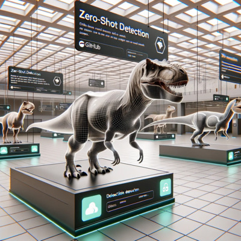
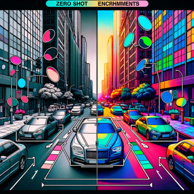
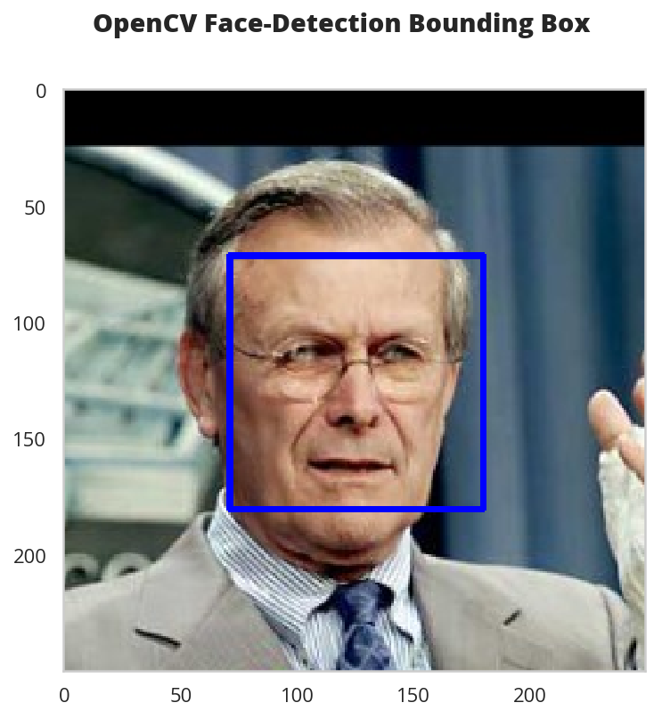
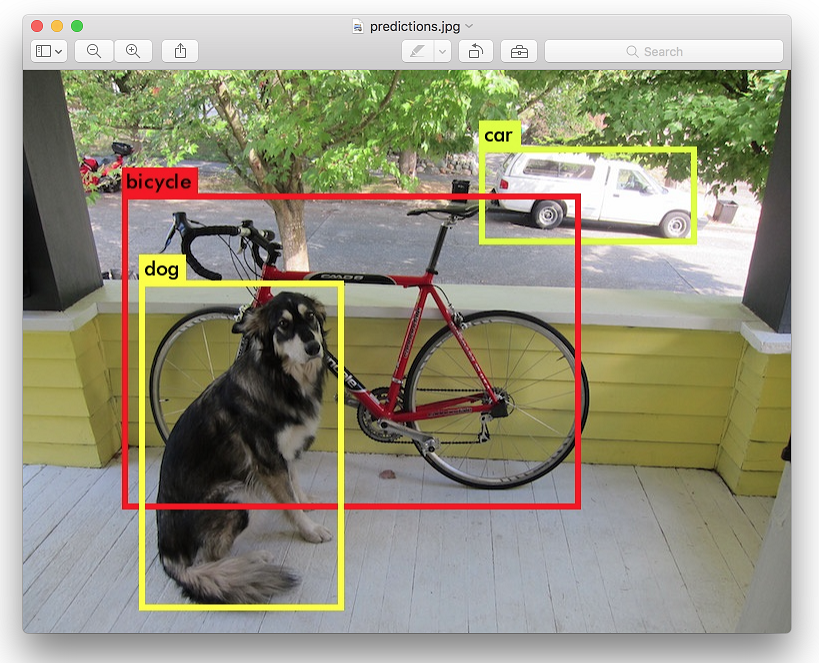

<!-- PROJECT SHIELDS -->
<!--
*** I'm using markdown "reference style" links for readability.
*** Reference links are enclosed in brackets [ ] instead of parentheses ( ).
*** See the bottom of this document for the declaration of the reference variables
*** for contributors-url, forks-url, etc. This is an optional, concise syntax you may use.
*** https://www.markdownguide.org/basic-syntax/#reference-style-links
-->

[![PyPi][pypi-shield]][pypi-url]
[![PyPi][pypiversion-shield]][pypi-url]
[![PyPi][downloads-shield]][downloads-url]
[![Contributors][contributors-shield]][contributors-url]
[![License][license-shield]][license-url]
[![OS][os-shield]][os-url]


<!-- MARKDOWN LINKS & IMAGES -->
<!-- https://www.markdownguide.org/basic-syntax/#reference-style-links -->
[pypi-shield]: https://img.shields.io/badge/Python-3.8%20|%203.9%20|%203.10%20|%203.11-blue?style=for-the-badge
[pypi-url]: https://pypi.org/project/fastdup/
[pypiversion-shield]: https://img.shields.io/pypi/v/fastdup?style=for-the-badge&color=success
[downloads-shield]: https://img.shields.io/pypi/dm/fastdup?style=for-the-badge&color=lightblue
[downloads-url]: https://pypi.org/project/fastdup/
[contributors-shield]: https://img.shields.io/github/contributors/visual-layer/fastdup?style=for-the-badge&color=orange
[contributors-url]: https://github.com/othneildrew/Best-README-Template/graphs/contributors
[license-shield]: https://img.shields.io/badge/License-CC%20BY--NC--ND%204.0-purple.svg?style=for-the-badge
[license-url]: https://github.com/visual-layer/fastdup/blob/main/LICENSE
[os-shield]: https://img.shields.io/badge/Supported%20OS-macOS%20%7C%20Linux%20%7C%20Windows%20-yellow?style=for-the-badge&logo=windows&logoColor=white
[os-url]: https://visual-layer.readme.io/docs/installation

<!-- PROJECT LOGO -->
<br />
<div align="center">
  <a href="https://www.visual-layer.com" target="_blank" rel="noopener noreferrer" name="top">
    <picture>
    <source media="(prefers-color-scheme: dark)" srcset="./gallery/logo_dark_mode.png" width=400>
    <source media="(prefers-color-scheme: light)" srcset="./gallery/logo.png" width=400>
    
    </picture>
  </a>

<h3 align="center">Manage, Clean & Curate Visual Data - Fast and at Scale.</h3>
  <p align="center">
  An unsupervised and free tool for image and video dataset analysis.
<p>Founded by the authors of <a href="https://github.com/apache/tvm">XGBoost</a>, <a href="https://github.com/apache/tvm">Apache TVM</a> & <a href="https://github.com/apple/turicreate">Turi Create</a> - <a href="https://www.linkedin.com/in/dr-danny-bickson-835b32">Danny Bickson</a>, <a href="https://www.linkedin.com/in/carlos-guestrin-5352a869">Carlos Guestrin</a> and <a href="https://www.linkedin.com/in/amiralush">Amir Alush</a>.</p>
    <br />
    <br />
    <a href="https://visual-layer.readme.io/" target="_blank" rel="noopener noreferrer"><strong>Explore the docs »</strong></a>
    <br />
    <a href="#whats-included-in-fastdup" target="_blank" rel="noopener noreferrer">Features</a>
    ·
    <a href="https://github.com/visual-layer/fastdup/issues/new/choose" target="_blank" rel="noopener noreferrer">Report Bug</a>
    ·
    <a href="https://medium.com/visual-layer" target="_blank" rel="noopener noreferrer">Blog</a>
    ·
    <a href="https://visual-layer.readme.io/docs/getting-started" target="_blank" rel="noopener noreferrer">Quickstart</a>
    ·
    <a href="https://app.visual-layer.com/vl-datasets?utm_source=fastdup_readme" target="_blank" rel="noopener noreferrer">Visual Layer Cloud</a>
    ·
    <a href="https://visual-layer.com/about" target="_blank" rel="noopener noreferrer">About us</a>
    <br />
    <br /> 
    <a href="https://discord.gg/Dqw458EG" target="_blank" rel="noopener noreferrer">
    
    </a>
    <a href="https://visual-layer.readme.io/discuss" target="_blank" rel="noopener noreferrer">
    
    </a>
    <a href="https://www.linkedin.com/company/visual-layer/" target="_blank" rel="noopener noreferrer">
    
    </a>
    <a href="https://twitter.com/visual_layer" target="_blank" rel="noopener noreferrer">
    
    </a>
    <a href="https://www.youtube.com/@visual-layer" target="_blank" rel="noopener noreferrer">
    
    </a>
  </p>
  <br />
  <br />


<br />
</div>

## Getting Started

pip install and run fastdup:

```bash
pip install fastdup
```

```python
import fastdup

fd = fastdup.create(input_dir="IMAGE_FOLDER/")
fd.run()
```

Explore the results in a interactive web UI:

```python
fd.explore()   
```


Visualize the result.

```python
fd.vis.duplicates_gallery()    # gallery of duplicates
fd.vis.outliers_gallery()      # gallery of anomalies
fd.vis.component_gallery()     # gallery of connected components
fd.vis.stats_gallery()         # gallery of image statistics (e.g. blur, brightness, etc.)
fd.vis.similarity_gallery()    # gallery of similar images
```


## Features & Advantages
fastdup handles both labeled and unlabeled image/video datasets, helping you to discover potential quality 
concerns while providing extra functionalities.

<div align="center" style="display:flex;flex-direction:column;">
  <a href="https://www.visual-layer.com" target="_blank" rel="noopener noreferrer">
    
  </a>
 </div>


What sets fastdup apart from other similar tools: 

+ 🎯 **Quality**: High-quality analysis to remove duplicates/near-duplicates, anomalies, mislabels, broken images, and poor-quality images.
+ 📊 **Scale**: Handles 400M images on a single CPU machine. Enterprise version scales to billions of images.
+ 🚀 **Speed**: Highly optimized C++ engine runs efficiently even on low-resource CPU machines.
+ 🔒 **Privacy**: Runs locally or on your cloud infrastructure. Your data stays where it is.
+ 😊 **Ease of use**: Works on labeled or unlabeled datasets, images, or videos. Get started with just [3 lines of code](#getting-started).


## Learn from Examples
Learn the basics of fastdup through interactive examples. View the notebooks on GitHub or nbviewer. Even better, run them on Google Colab or Kaggle, for free.


<table>
   <tr>
      <td rowspan="4" width="160">
         <a href="https://visual-layer.readme.io/docs/getting-started">
         
         </a>
      </td>
      <td rowspan="4">
         <b>⚡ Quickstart:</b> Learn how to install fastdup, load a dataset and analyze it for potential issues such as duplicates/near-duplicates, broken images, outliers, dark/bright/blurry images, and view visually similar image clusters. If you're new, start here!
         <br>
         <br>
         <b>📌 Dataset:</b> <a href="https://www.robots.ox.ac.uk/~vgg/data/pets/">Oxford-IIIT Pet</a>.
      </td>
      <td align="center" width="80">
         <a href="https://nbviewer.org/github/visual-layer/fastdup/blob/main/examples/quick-dataset-analysis.ipynb">
         
         </a>
      </td>
   </tr>
   <tr>
      <td align="center">
         <a href="https://github.com/visual-layer/fastdup/blob/main/examples/quick-dataset-analysis.ipynb">
         
         </a>
      </td>
   </tr>
   <tr>
      <td align="center">
         <a href="https://colab.research.google.com/github/visual-layer/fastdup/blob/main/examples/quick-dataset-analysis.ipynb">
         
         </a>
      </td>
   </tr>
   <tr>
      <td align="center">
         <a href="https://kaggle.com/kernels/welcome?src=https://github.com/visual-layer/fastdup/blob/main/examples/quick-dataset-analysis.ipynb">
         
         </a>
      </td>
   </tr>
   <!-- ------------------------------------------------------------------- -->
   <tr>
      <td rowspan="4" width="160">
         <a href="https://visual-layer.readme.io/docs/cleaning-image-dataset">
         
         </a>
      </td>
      <td rowspan="4">
         <b>🧹 Clean Image Folder:</b> Learn how to analyze and clean a folder of images from potential issues and export a list of problematic files for further action. If you have an unorganized folder of images, this is a good place to start.
         <br>
         <br>
         <b>📌 Dataset:</b> <a href="https://data.vision.ee.ethz.ch/cvl/datasets_extra/food-101/">Food-101</a>.
      </td>
      <td align="center" width="80">
         <a href="https://nbviewer.org/github/visual-layer/fastdup/blob/main/examples/cleaning-image-dataset.ipynb">
         
         </a>
      </td>
   </tr>
   <tr>
      <td align="center">
         <a href="https://github.com/visual-layer/fastdup/blob/main/examples/cleaning-image-dataset.ipynb">
         
         </a>
      </td>
   </tr>
   <tr>
      <td align="center">
         <a href="https://colab.research.google.com/github/visual-layer/fastdup/blob/main/examples/cleaning-image-dataset.ipynb">
         
         </a>
      </td>
   </tr>
   <tr>
      <td align="center">
         <a href="https://kaggle.com/kernels/welcome?src=https://github.com/visual-layer/fastdup/blob/main/examples/cleaning-image-dataset.ipynb">
         
         </a>
      </td>
   </tr>
   <!-- ------------------------------------------------------------------- -->
   <tr>
      <td rowspan="4" width="160">
         <a href="https://visual-layer.readme.io/docs/analyzing-labeled-images">
         
         </a>
      </td>
      <td rowspan="4">
         <b>🖼 Analyze Image Classification Dataset:</b> Learn how to load a labeled image classification dataset and analyze for potential issues. If you have labeled ImageNet-style folder structure, have a go!
         <br>
         <br>
         <b>📌 Dataset:</b> <a href="https://github.com/fastai/imagenette">Imagenette</a>.
      </td>
      <td align="center" width="80">
         <a href="https://nbviewer.org/github/visual-layer/fastdup/blob/main/examples/analyzing-image-classification-dataset.ipynb">
         
         </a>
      </td>
   </tr>
   <tr>
      <td align="center">
         <a href="https://github.com/visual-layer/fastdup/blob/main/examples/analyzing-image-classification-dataset.ipynb">
         
         </a>
      </td>
   </tr>
   <tr>
      <td align="center">
         <a href="https://colab.research.google.com/github/visual-layer/fastdup/blob/main/examples/analyzing-image-classification-dataset.ipynb">
         
         </a>
      </td>
   </tr>
   <tr>
      <td align="center">
         <a href="https://kaggle.com/kernels/welcome?src=https://github.com/visual-layer/fastdup/blob/main/examples/analysing-image-classification-dataset.ipynb">
         
         </a>
      </td>
   </tr>
   <!-- ------------------------------------------------------------------- -->
   <tr>
      <td rowspan="4" width="160">
         <a href="https://visual-layer.readme.io/docs/objects-and-bounding-boxes">
         
         </a>
      </td>
      <td rowspan="4">
         <b>🎁 Analyze Object Detection Dataset:</b> Learn how to load bounding box annotations for object detection and analyze for potential issues. If you have a COCO-style labeled object detection dataset, give this example a try. 
         <br>
         <br>
         <b>📌 Dataset:</b> <a href="https://cocodataset.org/#home">COCO</a>.
      </td>
      <td align="center" width="80">
         <a href="https://nbviewer.org/github/visual-layer/fastdup/blob/main/examples/analyzing-object-detection-dataset.ipynb">
         
         </a>
      </td>
   </tr>
   <tr>
      <td align="center">
         <a href="https://github.com/visual-layer/fastdup/blob/main/examples/analyzing-object-detection-dataset.ipynb">
         
         </a>
      </td>
   </tr>
   <tr>
      <td align="center">
         <a href="https://colab.research.google.com/github/visual-layer/fastdup/blob/main/examples/analyzing-object-detection-dataset.ipynb">
         
         </a>
      </td>
   </tr>
   <tr>
      <td align="center">
         <a href="https://kaggle.com/kernels/welcome?src=https://github.com/visual-layer/fastdup/blob/main/examples/analyzing-object-detection-dataset.ipynb">
         
         </a>
      </td>
   </tr>
   <!-- ------------------------------------------------------------------- -->
</table>


## Load Data From Sources
The notebooks in this section show how to load data from various sources and analyze them with fastdup.

<table>
    <tr>
        <td rowspan="4" width="160">
            <a href="https://visual-layer.readme.io/docs/hugging-face-datasets">
                
            </a>
        </td>
        <td rowspan="4"><b>🤗 Hugging Face Datasets:</b> Load and analyze datasets from <a href="https://huggingface.co/datasets">Hugging Face Datasets</a>. Perfect if you already have a dataset hosted on Hugging Face hub.<br><br>
        <div align="right"><a href="https://visual-layer.readme.io/docs/hugging-face-datasets">🔗 Learn More.</a></div>
        </td>
        <td align="center" width="80">
            <a href="https://nbviewer.org/github/visual-layer/fastdup/blob/main/examples/analyzing-hf-datasets.ipynb">
                
            </a>
        </td>
    </tr>
    <tr>
        <td align="center">
            <a href="https://github.com/visual-layer/fastdup/blob/main/examples/analyzing-hf-datasets.ipynb">
                
            </a>
        </td>
    </tr>
    <tr>
        <td align="center">
            <a href="https://colab.research.google.com/github/visual-layer/fastdup/blob/main/examples/analyzing-hf-datasets.ipynb">
                
            </a>
        </td>
    </tr>
    <tr>
        <td align="center">
            <a href="https://kaggle.com/kernels/welcome?src=https://github.com/visual-layer/fastdup/blob/main/examples/analyzing-hf-datasets.ipynb">
                
            </a>
        </td>
    </tr>
    <!-- ------------------------------------------------------------------- -->
    <tr>
        <td rowspan="4" width="160">
            <a href="https://visual-layer.readme.io/docs/kaggle">
                
            </a>
        </td>
        <td rowspan="4"><b>🏆 Kaggle:</b> Load and analyze any computer vision datasets from <a href="https://kaggle.com">Kaggle</a>. Get ahead of your competition with data insights.<br><br>
        <div align="right"><a href="https://visual-layer.readme.io/docs/kaggle">🔗 Learn More.</a></div>
        </td>
        <td align="center" width="80">
            <a href="https://nbviewer.org/github/visual-layer/fastdup/blob/main/examples/analyzing-kaggle-datasets.ipynb">
                
            </a>
        </td>
    </tr>
    <tr>
        <td align="center">
            <a href="https://github.com/visual-layer/fastdup/blob/main/examples/analyzing-kaggle-datasets.ipynb">
                
            </a>
        </td>
    </tr>
    <tr>
        <td align="center">
            <a href="https://colab.research.google.com/github/visual-layer/fastdup/blob/main/examples/analyzing-kaggle-datasets.ipynb">
                
            </a>
        </td>
    </tr>
    <tr>
        <td align="center">
            <a href="https://kaggle.com/kernels/welcome?src=https://github.com/visual-layer/fastdup/blob/main/examples/analyzing-kaggle-datasets.ipynb">
                
            </a>
        </td>
    </tr>
    <!-- ------------------------------------------------------------------- -->
    <tr>
        <td rowspan="4" width="160">
            <a href="https://visual-layer.readme.io/docs/roboflow-universe">
                
            </a>
        </td>
        <td rowspan="4"><b>🌎 Roboflow Universe:</b> Load and analyze any computer vision datasets from <a href="https://universe.roboflow.com/">Roboflow Universe</a>. Analyze any of the 200,000 datasets on Roboflow Universe.<br><br>
        <div align="right"><a href="https://visual-layer.readme.io/docs/roboflow-universe">🔗 Learn More.</a></div>
        </td>
        <td align="center" width="80">
            <a href="https://nbviewer.org/github/visual-layer/fastdup/blob/main/examples/analyzing-roboflow-datasets.ipynb">
                
            </a>
        </td>
    </tr>
    <tr>
        <td align="center">
            <a href="https://github.com/visual-layer/fastdup/blob/main/examples/analyzing-roboflow-datasets.ipynb">
                
            </a>
        </td>
    </tr>
    <tr>
        <td align="center">
            <a href="https://colab.research.google.com/github/visual-layer/fastdup/blob/main/examples/analyzing-roboflow-datasets.ipynb">
                
            </a>
        </td>
    </tr>
    <tr>
        <td align="center">
            <a href="https://kaggle.com/kernels/welcome?src=https://github.com/visual-layer/fastdup/blob/main/examples/analyzing-roboflow-datasets.ipynb">
                
            </a>
        </td>
    </tr>
    <!-- ------------------------------------------------------------------- -->
    <tr>
        <td rowspan="4" width="160">
            <a href="https://visual-layer.readme.io/docs/analyzing-labelbox-datasets">
                
            </a>
        </td>
        <td rowspan="4"><b>📦 Labelbox:</b> Load and analyze vision datasets from <a href="https://labelbox.com/">Labelbox</a> - A data-centric AI platform for building intelligent applications.<br><br>
        <div align="right"><a href="https://visual-layer.readme.io/docs/analyzing-labelbox-datasets">🔗 Learn More.</a></div>
        </td>
        <td align="center" width="80">
            <a href="https://nbviewer.org/github/visual-layer/fastdup/blob/main/examples/analyzing-labelbox-datasets.ipynb">
                
            </a>
        </td>
    </tr>
    <tr>
        <td align="center">
            <a href="https://github.com/visual-layer/fastdup/blob/main/examples/analyzing-labelbox-datasets.ipynb">
                
            </a>
        </td>
    </tr>
    <tr>
        <td align="center">
            <a href="https://colab.research.google.com/github/visual-layer/fastdup/blob/main/examples/analyzing-labelbox-datasets.ipynb">
                
            </a>
        </td>
    </tr>
    <tr>
        <td align="center">
            <a href="https://kaggle.com/kernels/welcome?src=https://github.com/visual-layer/fastdup/blob/main/examples/analyzing-labelbox-datasets.ipynb">
                
            </a>
        </td>
    </tr>
    <!-- ------------------------------------------------------------------- -->
    <tr>
        <td rowspan="4" width="160">
            <a href="https://visual-layer.readme.io/docs/analyzing-torchvision-datasets">
                
            </a>
        </td>
        <td rowspan="4"><b>🔦 Torchvision Datasets:</b> Load and analyze vision datasets from <a href="https://pytorch.org/vision/main/datasets.html">Torchvision Datasets</a>.<br><br>
        <div align="right"><a href="https://visual-layer.readme.io/docs/analyzing-torchvision-datasets">🔗 Learn More.</a></div>
        </td>
        <td align="center" width="80">
            <a href="https://nbviewer.org/github/visual-layer/fastdup/blob/main/examples/analyzing-torchvision-datasets.ipynb">
                
            </a>
        </td>
    </tr>
    <tr>
        <td align="center">
            <a href="https://github.com/visual-layer/fastdup/blob/main/examples/analyzing-torchvision-datasets.ipynb">
                
            </a>
        </td>
    </tr>
    <tr>
        <td align="center">
            <a href="https://colab.research.google.com/github/visual-layer/fastdup/blob/main/examples/analyzing-torchvision-datasets.ipynb">
                
            </a>
        </td>
    </tr>
    <tr>
        <td align="center">
            <a href="https://kaggle.com/kernels/welcome?src=https://github.com/visual-layer/fastdup/blob/main/examples/analyzing-torchvision-datasets.ipynb">
                
            </a>
        </td>
    </tr>
    <!-- ------------------------------------------------------------------- -->
    <tr>
        <td rowspan="4" width="160">
            <a href="https://visual-layer.readme.io/docs/analyzing-tensorflow-datasets">
                
            </a>
        </td>
        <td rowspan="4"><b>💦 Tensorflow Datasets:</b> Load and analyze vision datasets from <a href="https://www.tensorflow.org/datasets">Tensorflow Datasets</a>.<br><br>
        <div align="right"><a href="https://visual-layer.readme.io/docs/analyzing-tensorflow-datasets">🔗 Learn More.</a></div>
        </td>
        <td align="center" width="80">
            <a href="https://nbviewer.org/github/visual-layer/fastdup/blob/main/examples/analyzing-tensorflow-datasets.ipynb">
                
            </a>
        </td>
    </tr>
    <tr>
        <td align="center">
            <a href="https://github.com/visual-layer/fastdup/blob/main/examples/analyzing-tensorflow-datasets.ipynb">
                
            </a>
        </td>
    </tr>
    <tr>
        <td align="center">
            <a href="https://colab.research.google.com/github/visual-layer/fastdup/blob/main/examples/analyzing-tensorflow-datasets.ipynb">
                
            </a>
        </td>
    </tr>
    <tr>
        <td align="center">
            <a href="https://kaggle.com/kernels/welcome?src=https://github.com/visual-layer/fastdup/blob/main/examples/analyzing-tensorflow-datasets.ipynb">
                
            </a>
        </td>
    </tr>
    <!-- ------------------------------------------------------------------- -->
</table>

## Enrich Data Using Foundation Models
The notebooks in this section show how to enrich your visual dataset using various foundation models supported in fastdup.

<table>
   <tr>
      <td rowspan="4" width="160">
         <a href="https://visual-layer.readme.io/docs/enrichment-zero-shot-classification">
         
         </a>
      </td>
      <td rowspan="4">
         <b> 🎞 Zero-Shot Classification:</b> Enrich your visual data with zero-shot image classification and tagging models such as <a href="https://github.com/xinyu1205/recognize-anything">Recognize Anything Model</a>, <a href="https://github.com/xinyu1205/recognize-anything">Tag2Text</a>, and more.<br><br>
        <div align="right"><a href="https://visual-layer.readme.io/docs/enrichment-zero-shot-classification">🔗 Learn More.</a></div>
      </td>
      <td align="center" width="80">
         <a href="https://nbviewer.org/github/visual-layer/fastdup/blob/main/examples/enrichment-zero-shot-classification.ipynb">
         
         </a>
      </td>
   </tr>
   <tr>
      <td align="center">
         <a href="https://github.com/visual-layer/fastdup/blob/main/examples/enrichment-zero-shot-classification.ipynb">
         
         </a>
      </td>
   </tr>
   <tr>
      <td align="center">
         <a href="https://colab.research.google.com/github/visual-layer/fastdup/blob/main/examples/enrichment-zero-shot-classification.ipynb">
         
         </a>
      </td>
   </tr>
   <tr>
      <td align="center">
         <a href="https://kaggle.com/kernels/welcome?src=https://github.com/visual-layer/fastdup/blob/main/examples/enrichment-zero-shot-classification.ipynb">
         
         </a>
      </td>
   </tr>
   <!-- ------------------------------------------------------------------- -->
   <tr>
      <td rowspan="4" width="160">
         <a href="https://visual-layer.readme.io/docs/enrichment-zero-shot-detection">
         
         </a>
      </td>
      <td rowspan="4">
         <b> 🧭 Zero-Shot Detection:</b> Enrich your visual data with zero-shot image detection model such as <a href="https://github.com/IDEA-Research/GroundingDINO">Grounding DINO</a> and more.<br><br>
        <div align="right"><a href="https://visual-layer.readme.io/docs/enrichment-zero-shot-detection">🔗 Learn More.</a></div>
      </td>
      <td align="center" width="80">
         <a href="https://nbviewer.org/github/visual-layer/fastdup/blob/main/examples/enrichment-zero-shot-detection.ipynb">
         
         </a>
      </td>
   </tr>
   <tr>
      <td align="center">
         <a href="https://github.com/visual-layer/fastdup/blob/main/examples/enrichment-zero-shot-detection.ipynb">
         
         </a>
      </td>
   </tr>
   <tr>
      <td align="center">
         <a href="https://colab.research.google.com/github/visual-layer/fastdup/blob/main/examples/enrichment-zero-shot-detection.ipynb">
         
         </a>
      </td>
   </tr>
   <tr>
      <td align="center">
         <a href="https://kaggle.com/kernels/welcome?src=https://github.com/visual-layer/fastdup/blob/main/examples/enrichment-zero-shot-detection.ipynb">
         
         </a>
      </td>
   </tr>
   <!-- ------------------------------------------------------------------- -->
   <tr>
      <td rowspan="4" width="160">
         <a href="https://visual-layer.readme.io/docs/enrichment-zero-shot-segmentation">
         
         </a>
      </td>
      <td rowspan="4">
         <b> 🎯 Zero-Shot Segmentation:</b> Enrich your visual data with zero-shot image segmentation model such as <a href="https://github.com/facebookresearch/segment-anything">Segment Anything Model</a> and more.<br><br>
        <div align="right"><a href="https://visual-layer.readme.io/docs/enrichment-zero-shot-segmentation">🔗 Learn More.</a></div>
      </td>
      <td align="center" width="80">
         <a href="https://nbviewer.org/github/visual-layer/fastdup/blob/main/examples/enrichment-zero-shot-segmentation.ipynb">
         
         </a>
      </td>
   </tr>
   <tr>
      <td align="center">
         <a href="https://github.com/visual-layer/fastdup/blob/main/examples/enrichment-zero-shot-segmentation.ipynb">
         
         </a>
      </td>
   </tr>
   <tr>
      <td align="center">
         <a href="https://colab.research.google.com/github/visual-layer/fastdup/blob/main/examples/enrichment-zero-shot-segmentation.ipynb">
         
         </a>
      </td>
   </tr>
   <tr>
      <td align="center">
         <a href="https://kaggle.com/kernels/welcome?src=https://github.com/visual-layer/fastdup/blob/main/examples/enrichment-zero-shot-segmentation.ipynb">
         
         </a>
      </td>
   </tr>
   <!-- ------------------------------------------------------------------- -->
</table>

## Extract Features From Dataset
The notebooks in this section show how to run fastdup on your own embeddings in combination with frameworks like ONNX and PyTorch.
<table>
 <tr>
      <td rowspan="4" width="160">
         <a href="https://visual-layer.readme.io/docs/embeddings-timm">
         
         </a>
      </td>
      <td rowspan="4">
         <b> 🧠 TIMM Embeddings:</b> Compute dataset embeddings using <a href="https://github.com/huggingface/pytorch-image-models">TIMM (PyTorch Image Models)</a> and run fastdup over the them to surface dataset issues. Runs on CPU and GPU.
      </td>
      <td align="center" width="80">
         <a href="https://nbviewer.org/github/visual-layer/fastdup/blob/main/examples/embeddings-timm.ipynb">
         
         </a>
      </td>
   </tr>
   <tr>
      <td align="center">
         <a href="https://github.com/visual-layer/fastdup/blob/main/examples/embeddings-timm.ipynb">
         
         </a>
      </td>
   </tr>
   <tr>
      <td align="center">
         <a href="https://colab.research.google.com/github/visual-layer/fastdup/blob/main/examples/embeddings-timm.ipynb">
         
         </a>
      </td>
   </tr>
   <tr>
      <td align="center">
         <a href="https://kaggle.com/kernels/welcome?src=https://github.com/visual-layer/fastdup/blob/main/examples/embeddings-timm.ipynb">
         
         </a>
      </td>
   </tr>
   <!-- ------------------------------------------------------------------- -->
   <tr>
      <td rowspan="4" width="160">
         <a href="https://visual-layer.readme.io/docs/getting-started">
         
         </a>
      </td>
      <td rowspan="4">
         <b>🦖 DINOv2 Embeddings:</b> Extract feature vectors of your images using <a href="https://github.com/facebookresearch/dinov2">DINOv2</a> model. Runs on CPU.
      </td>
      <td align="center" width="80">
         <a href="https://nbviewer.org/github/visual-layer/fastdup/blob/main/examples/dinov2_notebook.ipynb">
         
         </a>
      </td>
   </tr>
   <tr>
      <td align="center">
         <a href="https://github.com/visual-layer/fastdup/blob/main/examples/dinov2_notebook.ipynb">
         
         </a>
      </td>
   </tr>
   <tr>
      <td align="center">
         <a href="https://colab.research.google.com/github/visual-layer/fastdup/blob/main/examples/dinov2_notebook.ipynb">
         
         </a>
      </td>
   </tr>
   <tr>
      <td align="center">
         <a href="https://kaggle.com/kernels/welcome?src=https://github.com/visual-layer/fastdup/blob/main/examples/dinov2_notebook.ipynb">
         
         </a>
      </td>
   </tr>
   <!-- ------------------------------------------------------------------- -->
   <tr>
      <td rowspan="4" width="160">
         <a href="https://visual-layer.readme.io/docs/running-over-extracted-features">
         
         </a>
      </td>
      <td rowspan="4">
         <b>➡️ Use Your Own Feature Vectors:</b> Run fastdup on pre-computed feature vectors and surface data quality issues.
      </td>
      <td align="center" width="80">
         <a href="https://nbviewer.org/github/visual-layer/fastdup/blob/main/examples/feature_vectors.ipynb">
         
         </a>
      </td>
   </tr>
   <tr>
      <td align="center">
         <a href="https://github.com/visual-layer/fastdup/blob/main/examples/feature_vectors.ipynb">
         
         </a>
      </td>
   </tr>
   <tr>
      <td align="center">
         <a href="https://colab.research.google.com/github/visual-layer/fastdup/blob/main/examples/feature_vectors.ipynb">
         
         </a>
      </td>
   </tr>
   <tr>
      <td align="center">
         <a href="https://kaggle.com/kernels/welcome?src=https://github.com/visual-layer/fastdup/blob/main/examples/feature_vectors.ipynb">
         
         </a>
      </td>
   </tr>
</table>

## Exciting New Features

> **Note**: We're happy to announce new features are out from beta testing and now available to the public, completely free of charge! We invite you to try them out and provide us with your valuable [feedback](https://visualdatabase.slack.com/join/shared_invite/zt-19jaydbjn-lNDEDkgvSI1QwbTXSY6dlA#/shared-invite/email)!

<table>
   <tr>
      <td rowspan="4" width="160">
         <a href="https://visual-layer.readme.io/docs/video-face-detection">
         
         </a>
      </td>
      <td rowspan="4">
         <b>😗 Face Detection in Videos:</b> Use fastdup with a face detection model to detect faces from videos and analyze the cropped faces for potential issues such as duplicates, near-duplicates, outliers, bright/dark/blurry faces.
      </td>
      <td align="center" width="80">
         <a href="https://nbviewer.org/github/visual-layer/fastdup/blob/main/examples/video-face-detection.ipynb">
         
         </a>
      </td>
   </tr>
   <tr>
      <td align="center">
         <a href="https://github.com/visual-layer/fastdup/blob/main/examples/video-face-detection.ipynb">
         
         </a>
      </td>
   </tr>
   <tr>
      <td align="center">
         <a href="https://colab.research.google.com/github/visual-layer/fastdup/blob/main/examples/video-face-detection.ipynb">
         
         </a>
      </td>
   </tr>
   <tr>
      <td align="center">
         <a href="https://kaggle.com/kernels/welcome?src=https://github.com/visual-layer/fastdup/blob/main/examples/video-face-detection.ipynb">
         
         </a>
      </td>
   </tr>
   <!-- ------------------------------------------------------------------- -->
   <tr>
      <td rowspan="4" width="160">
         <a href="https://visual-layer.readme.io/docs/video-yolov5-detection">
         
         </a>
      </td>
      <td rowspan="4">
         <b> 🤖 Object Detection in Videos:</b> Use fastdup with a pre-trained <a href="https://github.com/ultralytics/yolov5">YOLOv5</a> model to detect and analyze objects for potential issues such as duplicates, near-duplicates, outliers, bright/dark/blurry objects.
      </td>
      <td align="center" width="80">
         <a href="https://nbviewer.org/github/visual-layer/fastdup/blob/main/examples/video-yolov5-detection.ipynb">
         
         </a>
      </td>
   </tr>
   <tr>
      <td align="center">
         <a href="https://github.com/visual-layer/fastdup/blob/main/examples/video-yolov5-detection.ipynb">
         
         </a>
      </td>
   </tr>
   <tr>
      <td align="center">
         <a href="https://colab.research.google.com/github/visual-layer/fastdup/blob/main/examples/video-yolov5-detection.ipynb">
         
         </a>
      </td>
   </tr>
   <tr>
      <td align="center">
         <a href="https://kaggle.com/kernels/welcome?src=https://github.com/visual-layer/fastdup/blob/main/examples/video-yolov5-detection.ipynb">
         
         </a>
      </td>
   </tr>
   <!-- ------------------------------------------------------------------- -->
   <tr>
      <td rowspan="4" width="160">
         <a href="https://visual-layer.readme.io/docs/running-over-extracted-features">
         
         </a>
      </td>
      <td rowspan="4">
         <b>🔢 Optical Character Recognition:</b> Enrich your dataset by detecting multilingual texts with <a href="https://github.com/ultralytics/yolov5">PaddleOCR</a>.
      </td>
      <td align="center" width="80">
         <a href="https://nbviewer.org/github/visual-layer/fastdup/blob/main/examples/optical-character-recognition.ipynb">
         
         </a>
      </td>
   </tr>
   <tr>
      <td align="center">
         <a href="https://github.com/visual-layer/fastdup/blob/main/examples/optical-character-recognition.ipynb">
         
         </a>
      </td>
   </tr>
   <tr>
      <td align="center">
         <a href="https://colab.research.google.com/github/visual-layer/fastdup/blob/main/examples/optical-character-recognition.ipynb">
         
         </a>
      </td>
   </tr>
   <tr>
      <td align="center">
         <a href="https://kaggle.com/kernels/welcome?src=https://github.com/visual-layer/fastdup/blob/main/examples/optical-character-recognition.ipynb">
         
         </a>
      </td>
   </tr>
   <!-- ------------------------------------------------------------------- -->
   <tr>
      <td rowspan="4" width="160">
         <a href="https://visual-layer.readme.io/docs/running-over-extracted-features">
         
         </a>
      </td>
      <td rowspan="4">
         <b>📑 Image Captioning & Visual Question Answering (VQA):</b> Enrich your dataset by captioning them using <a href="https://github.com/salesforce/BLIP">BLIP</a>, <a href="https://github.com/salesforce/LAVIS/tree/main/projects/blip2">BLIP-2</a>, or <a href="https://huggingface.co/ydshieh/vit-gpt2-coco-en-ckpts">ViT-GPT2</a> model. Alternatively, use VQA models and ask question about the content of your images with <a href="https://github.com/dandelin/ViLT">Vilt-b32</a> or <a href="https://huggingface.co/nateraw/vit-age-classifier">ViT-Age</a> model.
      </td>
      <td align="center" width="80">
         <a href="https://nbviewer.org/github/visual-layer/fastdup/blob/main/examples/caption_generation.ipynb">
         
         </a>
      </td>
   </tr>
   <tr>
      <td align="center">
         <a href="https://github.com/visual-layer/fastdup/blob/main/examples/caption_generation.ipynb">
         
         </a>
      </td>
   </tr>
   <tr>
      <td align="center">
         <a href="https://colab.research.google.com/github/visual-layer/fastdup/blob/main/examples/caption_generation.ipynb">
         
         </a>
      </td>
   </tr>
   <tr>
      <td align="center">
         <a href="https://kaggle.com/kernels/welcome?src=https://github.com/visual-layer/fastdup/blob/main/examples/caption_generation.ipynb">
         
         </a>
      </td>
   </tr>
   <!-- ------------------------------------------------------------------- -->
   <tr>
      <td rowspan="4" width="160">
         <a href="https://visual-layer.readme.io/docs/image-search">
         
         </a>
      </td>
      <td rowspan="4">
         <b>🔍 Image Search:</b> Search through large image datasets for duplicates/near-duplicates using a query image. Runs on CPU!
      </td>
      <td align="center" width="80">
         <a href="https://nbviewer.org/github/visual-layer/fastdup/blob/main/examples/image-search.ipynb">
         
         </a>
      </td>
   </tr>
   <tr>
      <td align="center">
         <a href="https://github.com/visual-layer/fastdup/blob/main/examples/image-search.ipynb">
         
         </a>
      </td>
   </tr>
   <tr>
      <td align="center">
         <a href="https://colab.research.google.com/github/visual-layer/fastdup/blob/main/examples/image-search.ipynb">
         
         </a>
      </td>
   </tr>
   <tr>
      <td align="center">
         <a href="https://kaggle.com/kernels/welcome?src=https://github.com/visual-layer/fastdup/blob/main/examples/image-search.ipynb">
         
         </a>
      </td>
   </tr>
</table>


## Community

Get help from the fastdup team or community members via the following channels -
+ [Slack](https://visualdatabase.slack.com/join/shared_invite/zt-19jaydbjn-lNDEDkgvSI1QwbTXSY6dlA#/shared-invite/email).
+ GitHub [issues](https://github.com/visual-layer/fastdup/issues).
+ Discussion [forum](https://visual-layer.readme.io/discuss).


The following are community-contributed blog posts about fastdup - 

<table>
  <tr>
    <td></td>
    <td>
      <a href="https://medium.com/@atahanbulus.w/deploying-aws-lambda-functions-with-docker-container-by-using-custom-base-image-2d110d307f9b">Deploying AWS Lambda functions with Docker Container by using Custom Base Image</a><br>
      🖋️ <a href="https://medium.com/@atahanbulus.w">atahan bulus</a> &nbsp;&nbsp;&nbsp;•&nbsp;&nbsp;&nbsp; 🗓 16 September 2023
    </td>
  </tr>
  <tr>
    <td></td>
    <td>
      <a href="https://medium.com/@daniel-klitzke/cleaning-image-classification-datasets-with-fastdup-and-renumics-spotlight-e68deb4730a3">Renumics: Cleaning Image Classification Datasets With fastdup and Renumics Spotlight</a><br>
      🖋️ <a href="https://medium.com/@daniel-klitzke">Daniel Klitzke</a> &nbsp;&nbsp;&nbsp;•&nbsp;&nbsp;&nbsp; 🗓 4 September 2023
    </td>
  </tr>
  <tr>
    <td></td>
    <td>
      <a href="https://blog.roboflow.com/how-to-reduce-dataset-size-computer-vision/">Roboflow: How to Reduce Dataset Size Without Losing Accuracy</a><br>
      🖋️ <a href="https://blog.roboflow.com/author/arty/">Arty Ariuntuya</a> &nbsp;&nbsp;&nbsp;•&nbsp;&nbsp;&nbsp; 🗓 9 August 2023
    </td>
  </tr>
  <tr>
    <td></td>
    <td>
      <a href="https://alexlanseedoo.medium.com/the-weighty-significance-of-data-cleanliness-eb03dce1d0f8">The weighty significance of data cleanliness — or as I like to call it, “cleanliness is next to model-ness” — cannot be overstated.</a><br>
      🖋️ <a href="https://alexlanseedoo.medium.com/">Alexander Lan</a> &nbsp;&nbsp;&nbsp;•&nbsp;&nbsp;&nbsp; 🗓 9 March 2023
    </td>
  </tr>
  <tr>
    <td></td>
    <td>
      <a href="https://dicksonneoh.com/blog/clean_up_your_digital_life/">Clean Up Your Digital Life: How I Found 1929 Fully Identical Images, Dark, Bright and Blurry Shots in Minutes, For Free.</a><br>
      🖋️ <a href="https://medium.com/@dickson.neoh">Dickson Neoh</a> &nbsp;&nbsp;&nbsp;•&nbsp;&nbsp;&nbsp; 🗓 23 February 2023
    </td>
  </tr>
  <tr>
    <td></td>
    <td>
      <a href="https://dicksonneoh.com/portfolio/fastdup_manage_clean_curate/">fastdup: A Powerful Tool to Manage, Clean & Curate Visual Data at Scale on Your CPU - For Free.</a><br>
      🖋️ <a href="https://medium.com/@dickson.neoh">Dickson Neoh</a> &nbsp;&nbsp;&nbsp;•&nbsp;&nbsp;&nbsp; 🗓 3 January 2023
    </td>
  </tr>
  <tr>
    <td></td>
    <td>
      <a href="https://towardsdatascience.com/master-data-integrity-to-clean-your-computer-vision-datasets-df432cf9e596">Master Data Integrity to Clean Your Computer Vision Datasets.</a><br>
      🖋️ <a href="https://pauliusztin.medium.com/">Paul lusztin</a> &nbsp;&nbsp;&nbsp;•&nbsp;&nbsp;&nbsp; 🗓 19 December 2022
    </td>
  </tr>
</table>


What our users say


## License
fastdup is licensed under [Creative Commons Attribution-NonCommercial-NoDerivatives 4.0 International](https://creativecommons.org/licenses/by-nc-nd/4.0/) Public License. 

See [LICENSE](./LICENSE).


For any queries, reach us at info@visual-layer.com

## Disclaimer
<details>
  <summary><b>Usage Tracking</b></summary>

We have added an experimental crash report collection, using [sentry.io](https://github.com/getsentry/). It does not collect user data  and it only logs fastdup library's own actions. We do NOT collect folder names, user names, image names, image content only aggregate performance statistics like total number of images, average runtime per image, total free memory, total free disk space, number of cores, etc. Collecting fastdup crashes will help us improve stability. 

The code for the data collection is found [here](./fastdup/sentry.py). On MAC we use [Google crashpad](https://chromium.googlesource.com/crashpad/crashpad) to report crashes.

It is always possible to opt out of the experimental crash report collection via either of the following two options:
- Define an environment variable called `SENTRY_OPT_OUT`
- or run() with `turi_param='run_sentry=0'`

</details>

## About Visual-Layer

<div align="center">
<a href="https://www.visual-layer.com" target="_blank" rel="noopener noreferrer">
    <picture>
    <source media="(prefers-color-scheme: dark)" srcset="./gallery/visual_layer_logo_dark_mode.png" width=300>
    <source media="(prefers-color-scheme: light)" srcset="./gallery/visual_layer_logo.png" width=300>
    
    </picture>
</a>
</div>

<div align="center">
   <a href="https://visual-layer.com/about" target="_blank" style="text-decoration: none;"> About Us </a> •
    <a href="https://medium.com/visual-layer" target="_blank" style="text-decoration: none;"> Blog </a> •
    <a href="https://visual-layer.readme.io/" target="_blank" style="text-decoration: none;"> Documentation </a>
    
</div>

<div align="center">
    <a href="https://visual-layer.slack.com/" target="_blank" style="text-decoration: none;"> Slack Community </a> •
    <a href="https://visual-layer.readme.io/discuss" target="_blank" style="text-decoration: none;"> Discussion Forum </a> •
    <a href="https://www.linkedin.com/company/visual-layer/" target="_blank" style="text-decoration: none;"> LinkedIn </a> •
    <a href="https://twitter.com/visual_layer" target="_blank" style="text-decoration: none;"> Twitter </a>
</div>

<div align="right"><a href="#top">🔝 Back to Top</a></div>

