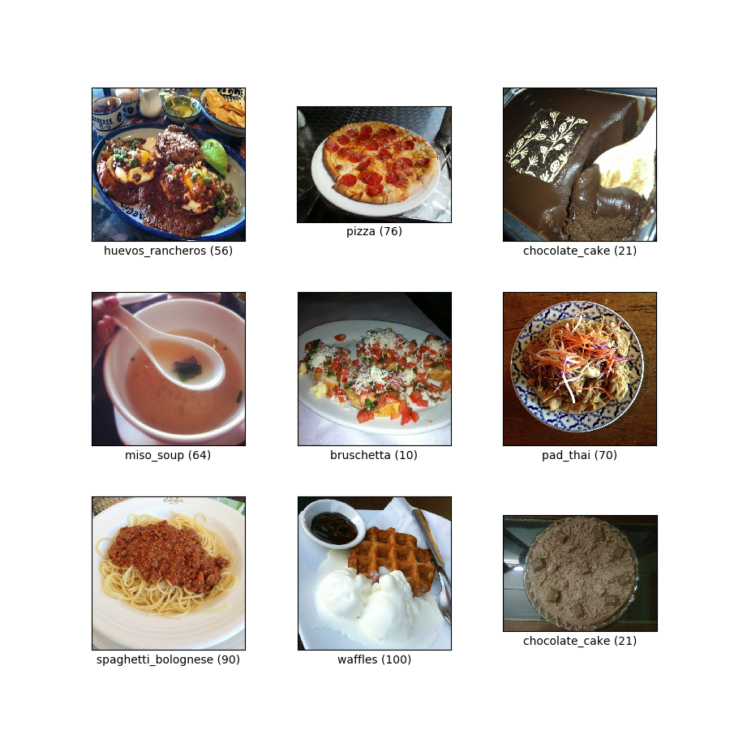
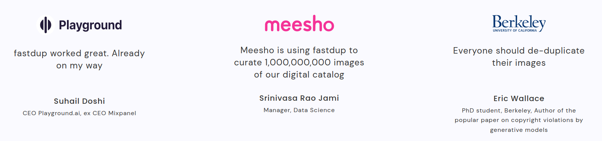

<!-- PROJECT SHIELDS -->
<!--
*** I'm using markdown "reference style" links for readability.
*** Reference links are enclosed in brackets [ ] instead of parentheses ( ).
*** See the bottom of this document for the declaration of the reference variables
*** for contributors-url, forks-url, etc. This is an optional, concise syntax you may use.
*** https://www.markdownguide.org/basic-syntax/#reference-style-links
-->

[![PyPi][pypi-shield]][pypi-url]
[![PyPi][pypiversion-shield]][pypi-url]
[![PyPi][downloads-shield]][downloads-url]
[![Contributors][contributors-shield]][contributors-url]
[![License][license-shield]][license-url]

<!-- MARKDOWN LINKS & IMAGES -->
<!-- https://www.markdownguide.org/basic-syntax/#reference-style-links -->
[pypi-shield]: https://img.shields.io/badge/Python-3.7%20|%203.8%20|%203.9%20|%203.10-blue?style=for-the-badge
[pypi-url]: https://pypi.org/project/fastdup/
[pypiversion-shield]: https://img.shields.io/pypi/v/fastdup?style=for-the-badge
[downloads-shield]: https://img.shields.io/badge/dynamic/json?style=for-the-badge&label=downloads&query=%24.total_downloads&url=https%3A%2F%2Fapi.pepy.tech%2Fapi%2Fprojects%2Ffastdup&color=lightblue
[downloads-url]: https://pypi.org/project/fastdup/
[contributors-shield]: https://img.shields.io/github/contributors/visual-layer/fastdup?style=for-the-badge
[contributors-url]: https://github.com/othneildrew/Best-README-Template/graphs/contributors
[license-shield]: https://img.shields.io/badge/License-CC%20BY%204.0-purple.svg?style=for-the-badge
[license-url]: https://github.com/visual-layer/fastdup/blob/main/LICENSE

<!-- PROJECT LOGO -->
<br />
<div align="center">
  <a href="https://www.visual-layer.com" target="_blank" rel="noopener noreferrer">
    <picture>
    <source media="(prefers-color-scheme: dark)" srcset="./gallery/logo_dark_mode.png" width=400>
    <source media="(prefers-color-scheme: light)" srcset="./gallery/logo.png" width=400>
    
    </picture>
  </a>

<h3 align="center">Manage, Clean & Curate Visual Data - Fast and at Scale</h3>

  <p align="center">
  An unsupervised and free tool for image and video dataset analysis.
    <br />
    <a href="https://visual-layer.readme.io/" target="_blank" rel="noopener noreferrer"><strong>Explore the docs »</strong></a>
    <br />
    <a href="https://visual-layer.readme.io/" target="_blank" rel="noopener noreferrer">Features</a>
    ·
    <a href="https://github.com/visual-layer/fastdup/issues" target="_blank" rel="noopener noreferrer">Report Bug</a>
    ·
    <a href="https://medium.com/@amiralush/large-image-datasets-today-are-a-mess-e3ea4c9e8d22" target="_blank" rel="noopener noreferrer">Read Blog</a>
    ·
    <a href="https://visual-layer.readme.io/docs/getting-started" target="_blank" rel="noopener noreferrer">Quickstart</a>
    ·
    <a href="https://visual-layer.com/" target="_blank" rel="noopener noreferrer">Enterprise Edition</a>
    ·
    <a href="https://visual-layer.com/" target="_blank" rel="noopener noreferrer">About us</a>
    <br />
    <br /> 
    <a href="https://visualdatabase.slack.com/join/shared_invite/zt-19jaydbjn-lNDEDkgvSI1QwbTXSY6dlA#/shared-invite/email" target="_blank" rel="noopener noreferrer">
    
    </a>
    <a href="https://visual-layer.readme.io/discuss" target="_blank" rel="noopener noreferrer">
    
    </a>
    <a href="https://www.linkedin.com/company/visual-layer/" target="_blank" rel="noopener noreferrer">
    
    </a>
    <a href="https://www.youtube.com/@visual-layer4035" target="_blank" rel="noopener noreferrer">
    
    </a>
  </p>
  <br />
    🔥 We've released fastdup V1.0! View the release notes
    <a href="./RELEASE_NOTES.md">here</a>.
    <br />
</div>

## What's Included
fastdup lets you identify -
 <div align="center" style="display:flex;flex-direction:column;">
  <a href="https://www.visual-layer.com" target="_blank" rel="noopener noreferrer">
    
  </a>
 </div>

Additional features -

<div align="center" style="display:flex;flex-direction:column;">
  <a href="https://www.visual-layer.com" target="_blank" rel="noopener noreferrer">
    
  </a>
 </div>


## Why fastdup?

* **Fast**: Efficient C++ engine with speed up to 2 ms per image - process up to 8M images per hour with a 32-core machine.
* **Scalable**: Handles up to 400M images on a single CPU machine.
* **Unsupervised**: Runs on unlabeled (or labeled) image/video data.
* **Cost**: Basic functions are free to use. Process up to 12M images on a $1 cloud machine budget. 

## Setting up

### Prerequisites 

> Supported `Python` versions:

[![PyPi][pypi-shield]][pypi-url]

> Supported operating systems:

[](https://visual-layer.readme.io/docs/installation#winnative)
[](https://visual-layer.readme.io/docs/installation#winnative)
[](https://visual-layer.readme.io/docs/installation#winnative)
[](https://visual-layer.readme.io/docs/installation#winnative)
[](https://visual-layer.readme.io/docs/installation#ubuntu-20041804-lts-machine-setup-a-nameubuntua)
[](https://visual-layer.readme.io/docs/installation#ubuntu-20041804-lts-machine-setup-a-nameubuntua)
[-000000?style=for-the-badge&logo=apple&logoColor=white)](https://visual-layer.readme.io/docs/installation#mac-os-setup-a-namemacosxa)
[-000000?style=for-the-badge&logo=apple&logoColor=white)](https://visual-layer.readme.io/docs/installation#mac-os-setup-a-namemacosxa)
[](https://visual-layer.readme.io/docs/installation#amazon-linux-2-setup-a-nameamazon_linuxa)
[](https://visual-layer.readme.io/docs/installation#centos-7-setup--amazon-linux-2--redhat-48-a-namecentos7a)
[](https://visual-layer.readme.io/docs/installation#centos-7-setup--amazon-linux-2--redhat-48-a-namecentos7a) 


### Installation

> **Option 1** - Install fastdup via [PyPI](https://pypi.org/project/fastdup/): 

```python
# upgrade pip to its latest version
pip install -U pip

# install fastdup
pip install fastdup
    
# Alternatively, use explicit python version (XX)
python3.XX -m pip install fastdup 
```

> **Option 2** - Install fastdup via an [Ubuntu 20.04 Docker image](https://hub.docker.com/r/karpadoni/fastdup-ubuntu-20.04) on DockerHub:

```bash
docker pull karpadoni/fastdup-ubuntu-20.04
```

Detailed installation instructions and common errors [here](https://visual-layer.readme.io/docs/installation).

## Getting Started

Run fastdup with only 3 lines of code.


Visualize the result.


Here are the 8 lines of code you'll need in most cases.

```python
import fastdup

fd = fastdup.create(work_dir, images_dir)
fd.run(nearest_neighbors_k=5, cc_threshold=0.96)

fd.vis.duplicates_gallery()    # create a visual gallery of found duplicates
fd.vis.outliers_gallery()      # create a visual gallery of anomalies
fd.vis.component_gallery()     # create a visualization of connected components
fd.vis.stats_gallery()         # create a visualization of images statistics (for example blur)
fd.vis.similarity_gallery()    # create a gallery of similar images
```

View the API docs [here](https://visual-layer.readme.io/docs/v1-api).

## Learn from Examples

<table>
  <tr>
      <td rowspan="3" width="160">
      <a href="https://visual-layer.readme.io/docs/getting-started">
              
      </a>
      </td>    
      <td rowspan="3">
        <b>Quick Dataset Analysis:</b> In this example, learn how to quickly analyze a dataset for potential issues. Identify duplicates, outliers, dark/bright/blurry images and cluster similar images with only a few lines of code. If you're new, start here.
      </td>
      <td align="center" width="80">
          <a href="https://nbviewer.org/github/visual-layer/fastdup/blob/main/examples/quick-dataset-analysis.ipynb">
              
          </a>
      </td>
  </tr>
  <tr>
      <td align="center">
          <a href="https://github.com/visual-layer/fastdup/blob/main/examples/quick-dataset-analysis.ipynb">
              
          </a>
      </td>
  </tr>
  <tr>
      <td align="center">
          <a href="https://colab.research.google.com/github/visual-layer/fastdup/blob/main/examples/quick-dataset-analysis.ipynb">
              
          </a>
      </td>
  </tr>

  <!-- ------------------------------------------------------------------- -->

  <tr>
      <td rowspan="3" width="160">
      <a href="https://visual-layer.readme.io/docs/cleaning-image-dataset">
              
      </a>
      </td>    
      <td rowspan="3">
        <b>Cleaning Image Dataset:</b> In this tutorial, learn how to clean a dataset from broken images, duplicates, outliers, and identify dark/bright/blurry images.
      </td>
      <td align="center" width="80">
          <a href="https://nbviewer.org/github/visual-layer/fastdup/blob/main/examples/cleaning-image-dataset.ipynb">
              
          </a>
      </td>
  </tr>
  <tr>
      <td align="center">
          <a href="https://github.com/visual-layer/fastdup/blob/main/examples/cleaning-image-dataset.ipynb">
              
          </a>
      </td>
  </tr>
  <tr>
      <td align="center">
          <a href="https://colab.research.google.com/github/visual-layer/fastdup/blob/main/examples/cleaning-image-dataset.ipynb">
              
          </a>
      </td>
  </tr>

  <!-- ------------------------------------------------------------------- -->

  <tr>
      <td rowspan="3" width="160">
      <a href="https://visual-layer.readme.io/docs/analyzing-labeled-images">
              
      </a>
      </td>    
      <td rowspan="3">
        <b>Analyzing Labeled Image Classification Dataset:</b> In this tutorial, learn how to analyze a labeled image classification dataset for potential issues. We use the Imagenette dataset, a 10-class, 13k image subset of ImageNet as a working example.
      </td>
      <td align="center" width="80">
          <a href="https://nbviewer.org/github/visual-layer/fastdup/blob/main/examples/analysing-image-classification-dataset.ipynb">
              
          </a>
      </td>
  </tr>
  <tr>
      <td align="center">
          <a href="https://github.com/visual-layer/fastdup/blob/main/examples/analysing-image-classification-dataset.ipynb">
              
          </a>
      </td>
  </tr>
  <tr>
      <td align="center">
          <a href="https://colab.research.google.com/github/visual-layer/fastdup/blob/main/examples/analysing-image-classification-dataset.ipynb">
              
          </a>
      </td>
  </tr>

  <!-- ------------------------------------------------------------------- -->

  <tr>
      <td rowspan="3" width="160">
      <a href="https://visual-layer.readme.io/docs/objects-and-bounding-boxes">
              
      </a>
      </td>    
      <td rowspan="3">
        <b>Analyzing Labeled Object Detection Dataset:</b> In this tutorial learn how to load and analyze an object detection dataset with labeled bounding boxes and classes. We use the mini-coco dataset as a working example. Learn how to discover duplicates, outliers, and possible mislabeled bounding boxes.
      </td>
      <td align="center" width="80">
          <a href="https://nbviewer.org/github/visual-layer/fastdup/blob/main/examples/preparing_a_labeled_object_dataset_for_training.ipynb">
              
          </a>
      </td>
  </tr>
  <tr>
      <td align="center">
          <a href="https://github.com/visual-layer/fastdup/blob/main/examples/preparing_a_labeled_object_dataset_for_training.ipynb">
              
          </a>
      </td>
  </tr>
  <tr>
      <td align="center">
          <a href="https://colab.research.google.com/drive/1MwxalEbILkSUt3NXZRhc9bWjfIGFbC6p">
              
          </a>
      </td>
  </tr>

  <!-- ------------------------------------------------------------------- -->
  
</table>


## Getting Help
Get help from the fastdup team or community members via the following channels -
+ [Slack](https://visualdatabase.slack.com/join/shared_invite/zt-19jaydbjn-lNDEDkgvSI1QwbTXSY6dlA#/shared-invite/email).
+ GitHub [issues](https://github.com/visual-layer/fastdup/issues).
+ Discussion [forum](https://visual-layer.readme.io/discuss).

## Community Contributions
The following are community-contributed blog posts about fastdup - 

- [Master Data Integrity to Clean Your Computer Vision Datasets
](https://towardsdatascience.com/master-data-integrity-to-clean-your-computer-vision-datasets-df432cf9e596)
- [fastdup: A Powerful Tool to Manage, Clean & Curate Visual Data at Scale on Your CPU - For Free.](https://dicksonneoh.com/portfolio/fastdup_manage_clean_curate/)
- [Clean Up Your Digital Life: How I Found 1929 Fully Identical Images, Dark, Bright and Blurry Shots in Minutes, For Free.](https://dicksonneoh.com/blog/clean_up_your_digital_life/)
- [The weighty significance of data cleanliness — or as I like to call it, “cleanliness is next to model-ness” — cannot be overstated.](https://alexlanseedoo.medium.com/the-weighty-significance-of-data-cleanliness-eb03dce1d0f8)
## What our users say



## License
fastdup is licensed under Creative Commons 4.0 license.
See [LICENSE](./LICENSE).

For any queries, reach us at info@visual-layer.com

## Disclaimer
<details>
  <summary><b>Usage Tracking</b></summary>

We have added an experimental crash report collection, using [sentry.io](https://github.com/getsentry/). It does not collect user data other than anonymized IP address data, and it only logs fastdup library's own actions. We do NOT collect folder names, user names, image names, image content only aggregate performance statistics like total number of images, average runtime per image, total free memory, total free disk space, number of cores, etc. Collecting fastdup crashes will help us improve stability. 

The code for the data collection is found [here](./src/sentry.hpp). On MAC we use [Google crashpad](https://chromium.googlesource.com/crashpad/crashpad). 

It is always possible to opt out of the experimental crash report collection via either of the following two options:
- Define an environment variable called `SENTRY_OPT_OUT`
- or run() with `turi_param='run_sentry=0'`

</details>

## About Visual-Layer

<div align="center">
<a href="https://www.visual-layer.com" target="_blank" rel="noopener noreferrer">
    <picture>
    <source media="(prefers-color-scheme: dark)" srcset="./gallery/visual_layer_logo_dark_mode.png" width=300>
    <source media="(prefers-color-scheme: light)" srcset="./gallery/visual_layer_logo.png" width=300>
    
    </picture>
</a>
</div>


fastdup is founded by the authors of [XGBoost](https://github.com/apache/tvm), [Apache TVM](https://github.com/apache/tvm) & [Turi Create](https://github.com/apple/turicreate) - [Danny Bickson](https://www.linkedin.com/in/dr-danny-bickson-835b32), [Carlos Guestrin](https://www.linkedin.com/in/carlos-guestrin-5352a869) and [Amir Alush](https://www.linkedin.com/in/amiralush).

Learn more about Visual Layer [here](https://visual-layer.com).