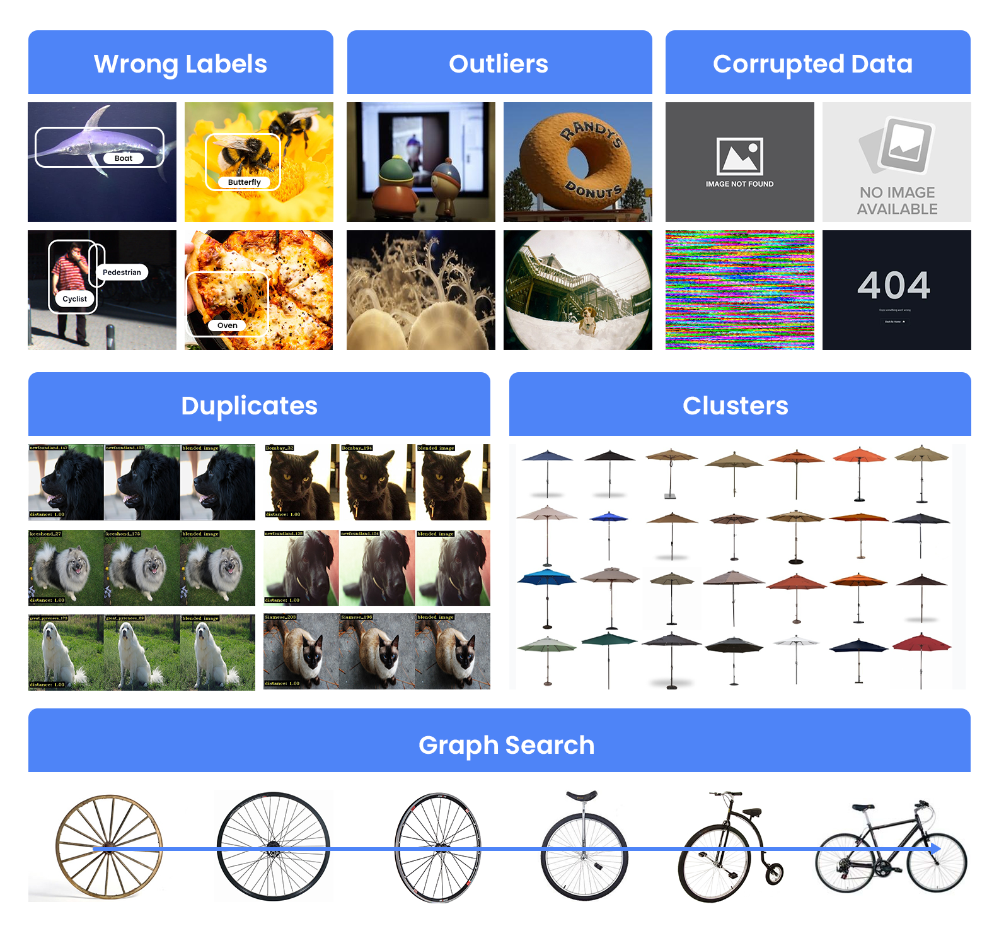
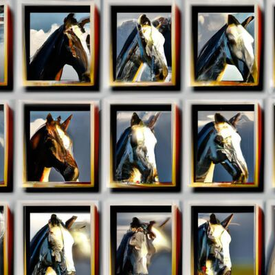
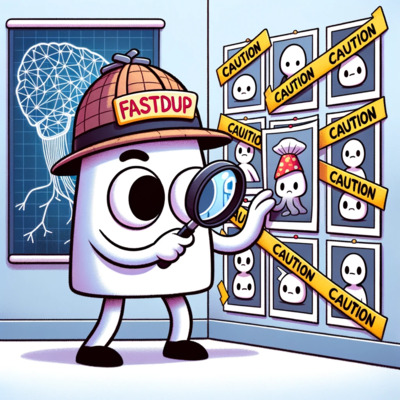
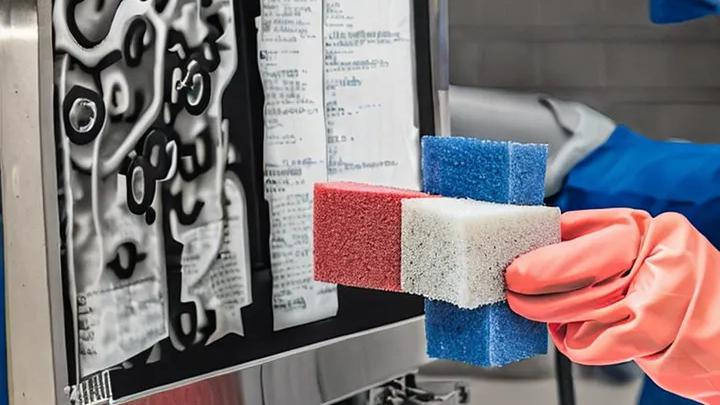
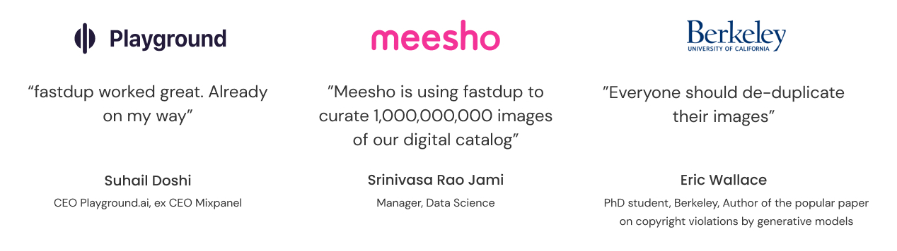
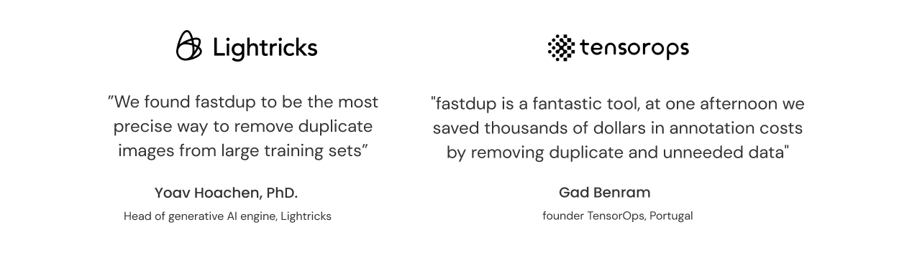

<!-- PROJECT LOGO -->
<br />
<div align="left">
  <a href="https://www.visual-layer.com" target="_blank" rel="noopener noreferrer" name="top">
    <picture>
    <source media="(prefers-color-scheme: dark)" srcset="./gallery/logo_dark_mode.png" width=600>
    <source media="(prefers-color-scheme: light)" srcset="./gallery/Logo-fastdup-by-VL.png" width=600>
    
    </picture>
  </a>
  <br>
  <br>
  </div>

<!-- <h3 align="left">Manage, Clean & Curate Visual Data - Fast and at Scale.</h3> -->

[![PyPi][pypi-shield]][pypi-url]
[![PyPi][pypiversion-shield]][pypi-url]
[![PyPi][downloads-shield]][downloads-url]
[![Contributors][contributors-shield]][contributors-url]
[![License][license-shield]][license-url]
[![OS][os-shield]][os-url]


<!-- MARKDOWN LINKS & IMAGES -->
<!-- https://www.markdownguide.org/basic-syntax/#reference-style-links -->
[pypi-shield]: https://img.shields.io/badge/Python-3.8%20|%203.9%20|%203.10%20|%203.11-blue?style=for-the-badge
[pypi-url]: https://pypi.org/project/fastdup/
[pypiversion-shield]: https://img.shields.io/pypi/v/fastdup?style=for-the-badge&color=lightblue
[downloads-shield]: https://img.shields.io/pepy/dt/fastdup?style=for-the-badge&color=success
[downloads-url]: https://pypi.org/project/fastdup/
[contributors-shield]: https://img.shields.io/github/contributors/visual-layer/fastdup?style=for-the-badge&color=orange
[contributors-url]: https://github.com/othneildrew/Best-README-Template/graphs/contributors
[license-shield]: https://img.shields.io/badge/License-CC%20BY--NC--ND%204.0-purple.svg?style=for-the-badge
[license-url]: https://github.com/visual-layer/fastdup/blob/main/LICENSE
[os-shield]: https://img.shields.io/badge/Supported%20OS-macOS%20%7C%20Linux%20%7C%20Windows(WSL2)%20-yellow?style=for-the-badge
[os-url]: https://docs.visual-layer.com/docs/installing-fastdup


<p align="left">
  A powerful open-source tool for analyzing image and video datasets founded by the authors of <a href="https://github.com/apache/tvm">XGBoost</a>, <a href="https://github.com/apache/tvm">Apache TVM</a> & <a href="https://github.com/apple/turicreate">Turi Create</a> - <a href="https://www.linkedin.com/in/dr-danny-bickson-835b32">Danny Bickson</a>, <a href="https://www.linkedin.com/in/carlos-guestrin-5352a869">Carlos Guestrin</a> and <a href="https://www.linkedin.com/in/amiralush">Amir Alush</a>.</p>
  <hr>
    <a href="https://visual-layer.readme.io/" target="_blank" rel="noopener noreferrer">Documentation</a>
    ·
    <a href="#features--advantages" target="_blank" rel="noopener noreferrer">Features</a>
    ·
    <a href="https://github.com/visual-layer/fastdup/issues/new/choose" target="_blank" rel="noopener noreferrer">Report Bug</a>
    ·
    <a href="https://medium.com/visual-layer" target="_blank" rel="noopener noreferrer">Blog</a>
    ·
    <a href="#getting-started" target="_blank" rel="noopener noreferrer">Quickstart</a>
    ·
    <a href="#visual-layer-cloud" target="_blank" rel="noopener noreferrer">Visual Layer Cloud</a>
    <hr>
</p>
    <!-- <br />
    <br /> 
    <a href="https://discord.gg/tkYHJCA7mb" target="_blank" rel="noopener noreferrer">
    
    </a>
    <a href="https://visual-layer.readme.io/discuss" target="_blank" rel="noopener noreferrer">
    
    </a>
    <a href="https://www.linkedin.com/company/visual-layer/" target="_blank" rel="noopener noreferrer">
    
    </a>
    <a href="https://twitter.com/visual_layer" target="_blank" rel="noopener noreferrer">
    
    </a>
    <a href="https://www.youtube.com/@visual-layer" target="_blank" rel="noopener noreferrer">
    
    </a>
  <br />
  <br /> -->

## Getting Started

`pip` install fastdup from [PyPI](https://pypi.org/project/fastdup/):

```bash
pip3 install fastdup
```
Note: should use Python3.9 - Python3.12

More installation options are available [here](https://visual-layer.readme.io/docs/installation).

Initialize and run fastdup:
```python
import fastdup

fd = fastdup.create(input_dir="IMAGE_FOLDER/")
fd.run()
```

Explore the results in a interactive web UI:

```python
fd.explore()   
```


Alternatively, visualize the result in a static gallery:

```python
fd.vis.duplicates_gallery()    # gallery of duplicates
fd.vis.outliers_gallery()      # gallery of outliers
fd.vis.component_gallery()     # gallery of connected components
fd.vis.stats_gallery()         # gallery of image statistics (e.g. blur, brightness, etc.)
fd.vis.similarity_gallery()    # gallery of similar images
```

## Check this [quickstart tutorial](https://youtu.be/Gt46ciEIxtw) for more info
https://github.com/user-attachments/assets/738a329d-8063-4515-a961-f2527934a0ca


## Features & Advantages
fastdup handles labeled/unlabeled datasets in image or video format, providing a range of features:

<div align="center" style="display:flex;flex-direction:column;">
  <a href="https://www.visual-layer.com" target="_blank" rel="noopener noreferrer">
    
  </a>
 </div>


What sets fastdup apart from other similar tools: 

+ **Quality**: High-quality analysis to identify duplicates/near-duplicates, outliers, mislabels, broken images, and low-quality images.
+ **Scale**: Highly scalable, capable of processing 400M images on a single CPU machine. Scales up to billions of images.
+ **Speed**: Optimized C++ engine enables high performance even on low-resource CPU machines.
+ **Privacy**: Runs locally or on your cloud infrastructure. Your data stays where it is.
+ **Ease of use**: Works on labeled or unlabeled datasets in image or video format with support for major operating systems like MacOS, Linux and Windows.


## Learn from Examples
Learn the basics of fastdup through interactive examples. View the notebooks on GitHub or nbviewer. Even better, run them on Google Colab or Kaggle, for free.


<table>
   <tr>
      <td rowspan="4" width="160">
         <a href="https://visual-layer.readme.io/docs/quickstart">
         
         </a>
      </td>
      <td rowspan="4">
         <b>⚡ Quickstart:</b> Learn how to install fastdup, load a dataset and analyze it for potential issues such as duplicates/near-duplicates, broken images, outliers, dark/bright/blurry images, and view visually similar image clusters. If you're new, start here!
         <br>
         <br>
         <b>📌 Dataset:</b> <a href="https://www.robots.ox.ac.uk/~vgg/data/pets/">Oxford-IIIT Pet</a>.
      </td>
      <td align="center" width="80">
         <a href="https://nbviewer.org/github/visual-layer/fastdup/blob/main/examples/quickstart.ipynb">
         
         </a>
      </td>
   </tr>
   <tr>
      <td align="center">
         <a href="https://github.com/visual-layer/fastdup/blob/main/examples/quickstart.ipynb">
         
         </a>
      </td>
   </tr>
   <tr>
      <td align="center">
         <a href="https://colab.research.google.com/github/visual-layer/fastdup/blob/main/examples/quickstart.ipynb">
         
         </a>
      </td>
   </tr>
   <tr>
      <td align="center">
         <a href="https://kaggle.com/kernels/welcome?src=https://github.com/visual-layer/fastdup/blob/main/examples/quickstart.ipynb">
         
         </a>
      </td>
   </tr>
   <!-- ------------------------------------------------------------------- -->
   <tr>
      <td rowspan="4" width="160">
         <a href="https://visual-layer.readme.io/docs/finding-removing-duplicates">
         
         </a>
      </td>
      <td rowspan="4">
         <b>🧹 Finding and Removing Duplicates:</b> Learn how to how to analyze an image dataset for duplicates and near-duplicates.
         <br>
         <br>
         <b>📌 Dataset:</b> <a href="https://www.robots.ox.ac.uk/~vgg/data/pets/">Oxford-IIIT Pet</a>.
      </td>
      <td align="center" width="80">
         <a href="https://nbviewer.org/github/visual-layer/fastdup/blob/main/examples/finding-removing-duplicates.ipynb">
         
         </a>
      </td>
   </tr>
   <tr>
      <td align="center">
         <a href="https://github.com/visual-layer/fastdup/blob/main/examples/finding-removing-duplicates.ipynb">
         
         </a>
      </td>
   </tr>
   <tr>
      <td align="center">
         <a href="https://colab.research.google.com/github/visual-layer/fastdup/blob/main/examples/finding-removing-duplicates.ipynb">
         
         </a>
      </td>
   </tr>
   <tr>
      <td align="center">
         <a href="https://kaggle.com/kernels/welcome?src=https://github.com/visual-layer/fastdup/blob/main/examples/finding-removing-duplicates.ipynb">
         
         </a>
      </td>
   </tr>
   <!-- ------------------------------------------------------------------- -->
   <tr>
      <td rowspan="4" width="160">
         <a href="https://visual-layer.readme.io/docs/finding-removing-mislabels">
         
         </a>
      </td>
      <td rowspan="4">
         <b>🖼 Finding and Removing Mislabels:</b> Learn how to analyze an image dataset for potential image mislabels and export the list of mislabeled images for further inspection.
         <br>
         <br>
         <b>📌 Dataset:</b> <a href="https://data.vision.ee.ethz.ch/cvl/datasets_extra/food-101/">Food-101</a>.
      </td>
      <td align="center" width="80">
         <a href="https://nbviewer.org/github/visual-layer/fastdup/blob/main/examples/finding-removing-mislabels.ipynb">
         
         </a>
      </td>
   </tr>
   <tr>
      <td align="center">
         <a href="https://github.com/visual-layer/fastdup/blob/main/examples/finding-removing-mislabels.ipynb">
         
         </a>
      </td>
   </tr>
   <tr>
      <td align="center">
         <a href="https://colab.research.google.com/github/visual-layer/fastdup/blob/main/examples/finding-removing-mislabels.ipynb">
         
         </a>
      </td>
   </tr>
   <tr>
      <td align="center">
         <a href="https://kaggle.com/kernels/welcome?src=https://github.com/visual-layer/fastdup/blob/main/examples/finding-removing-mislabels.ipynb">
         
         </a>
      </td>
   </tr>
   <!-- ------------------------------------------------------------------- -->
   <tr>
      <td rowspan="4" width="160">
         <a href="https://visual-layer.readme.io/docs/image-search">
         
         </a>
      </td>
      <td rowspan="4">
         <b>🎁 Image Similarity Search:</b> Perform image search in a large dataset of images.
         <br>
         <br>
         <b>📌 Dataset:</b> <a href="https://www.kaggle.com/competitions/shopee-product-matching/data">Shopee Product Matching</a>.
      </td>
      <td align="center" width="80">
         <a href="https://nbviewer.org/github/visual-layer/fastdup/blob/main/examples/image-search.ipynb">
         
         </a>
      </td>
   </tr>
   <tr>
      <td align="center">
         <a href="https://github.com/visual-layer/fastdup/blob/main/examples/image-search.ipynb">
         
         </a>
      </td>
   </tr>
   <tr>
      <td align="center">
         <a href="https://colab.research.google.com/github/visual-layer/fastdup/blob/main/examples/image-search.ipynb">
         
         </a>
      </td>
   </tr>
   <tr>
      <td align="center">
         <a href="https://kaggle.com/kernels/welcome?src=https://github.com/visual-layer/fastdup/blob/main/examples/image-search.ipynb">
         
         </a>
      </td>
   </tr>
   <!-- ------------------------------------------------------------------- -->
   <tr>
        <td rowspan="4" width="160">
            <a href="https://visual-layer.readme.io/docs/hugging-face-datasets">
                
            </a>
        </td>
        <td rowspan="4"><b>🤗 Hugging Face Datasets:</b> Load and analyze datasets from <a href="https://huggingface.co/datasets">Hugging Face Datasets</a>. Perfect if you already have a dataset hosted on Hugging Face hub.
        </td>
        <td align="center" width="80">
            <a href="https://nbviewer.org/github/visual-layer/fastdup/blob/main/examples/analyzing-hf-datasets.ipynb">
                
            </a>
        </td>
    </tr>
    <tr>
        <td align="center">
            <a href="https://github.com/visual-layer/fastdup/blob/main/examples/analyzing-hf-datasets.ipynb">
                
            </a>
        </td>
    </tr>
    <tr>
        <td align="center">
            <a href="https://colab.research.google.com/github/visual-layer/fastdup/blob/main/examples/analyzing-hf-datasets.ipynb">
                
            </a>
        </td>
    </tr>
    <tr>
        <td align="center">
            <a href="https://kaggle.com/kernels/welcome?src=https://github.com/visual-layer/fastdup/blob/main/examples/analyzing-hf-datasets.ipynb">
                
            </a>
        </td>
    </tr>
    <!-- ------------------------------------------------------------------- -->
    <tr>
      <td rowspan="4" width="160">
         <a href="https://visual-layer.readme.io/docs/embeddings-timm">
         
         </a>
      </td>
      <td rowspan="4">
         <b> 🧠 TIMM Embeddings:</b> Compute dataset embeddings using <a href="https://github.com/huggingface/pytorch-image-models">TIMM (PyTorch Image Models)</a> and run fastdup over the them to surface dataset issues. Runs on CPU and GPU.
      </td>
      <td align="center" width="80">
         <a href="https://nbviewer.org/github/visual-layer/fastdup/blob/main/examples/embeddings-timm.ipynb">
         
         </a>
      </td>
   </tr>
   <tr>
      <td align="center">
         <a href="https://github.com/visual-layer/fastdup/blob/main/examples/embeddings-timm.ipynb">
         
         </a>
      </td>
   </tr>
   <tr>
      <td align="center">
         <a href="https://colab.research.google.com/github/visual-layer/fastdup/blob/main/examples/embeddings-timm.ipynb">
         
         </a>
      </td>
   </tr>
   <tr>
      <td align="center">
         <a href="https://kaggle.com/kernels/welcome?src=https://github.com/visual-layer/fastdup/blob/main/examples/embeddings-timm.ipynb">
         
         </a>
      </td>
   </tr>
   <!-- ------------------------------------------------------------------- -->
   <tr>
      <td rowspan="4" width="160">
         <a href="https://visual-layer.readme.io/docs/getting-started">
         
         </a>
      </td>
      <td rowspan="4">
         <b>🦖 ONNX Embeddings:</b> Bring your own ONNX model. In this example we extract feature vectors of your images using <a href="https://github.com/facebookresearch/dinov2">DINOv2</a> model. Runs on CPU.
      </td>
      <td align="center" width="80">
         <a href="https://nbviewer.org/github/visual-layer/fastdup/blob/main/examples/embeddings-onnx-dinov2.ipynb">
         
         </a>
      </td>
   </tr>
   <tr>
      <td align="center">
         <a href="https://github.com/visual-layer/fastdup/blob/main/examples/embeddings-onnx-dinov2.ipynb">
         
         </a>
      </td>
   </tr>
   <tr>
      <td align="center">
         <a href="https://colab.research.google.com/github/visual-layer/fastdup/blob/main/examples/embeddings-onnx-dinov2.ipynb">
         
         </a>
      </td>
   </tr>
   <tr>
      <td align="center">
         <a href="https://kaggle.com/kernels/welcome?src=https://github.com/visual-layer/fastdup/blob/main/examples/embeddings-onnx-dinov2.ipynb">
         
         </a>
      </td>
   </tr>
   <!-- ------------------------------------------------------------------- -->
</table>

See more [examples](EXAMPLES.md).


## Join the Community

Get help from the fastdup team or community members via the following channels:

<a href="https://discord.gg/tkYHJCA7mb" target="_blank" rel="noopener noreferrer">
    
    </a>
<a href="https://visual-layer.readme.io/discuss" target="_blank" rel="noopener noreferrer">
    
    </a>
<a href="https://github.com/visual-layer/fastdup/issues/new/choose" target="_blank" rel="noopener noreferrer">
    
</a>


Community-contributed blog posts on fastdup:

<table>
  <tr>
    <td></td>
    <td>
      <a href="https://medium.com/@atahanbulus.w/deploying-aws-lambda-functions-with-docker-container-by-using-custom-base-image-2d110d307f9b">Deploying AWS Lambda functions with Docker Container by using Custom Base Image</a><br>
      🖋️ <a href="https://medium.com/@atahanbulus.w">atahan bulus</a> &nbsp;&nbsp;&nbsp;•&nbsp;&nbsp;&nbsp; 🗓 16 September 2023
    </td>
  </tr>
  <tr>
    <td></td>
    <td>
      <a href="https://medium.com/@daniel-klitzke/cleaning-image-classification-datasets-with-fastdup-and-renumics-spotlight-e68deb4730a3">Renumics: Cleaning Image Classification Datasets With fastdup and Renumics Spotlight</a><br>
      🖋️ <a href="https://medium.com/@daniel-klitzke">Daniel Klitzke</a> &nbsp;&nbsp;&nbsp;•&nbsp;&nbsp;&nbsp; 🗓 4 September 2023
    </td>
  </tr>
  <tr>
    <td></td>
    <td>
      <a href="https://blog.roboflow.com/how-to-reduce-dataset-size-computer-vision/">Roboflow: How to Reduce Dataset Size Without Losing Accuracy</a><br>
      🖋️ <a href="https://blog.roboflow.com/author/arty/">Arty Ariuntuya</a> &nbsp;&nbsp;&nbsp;•&nbsp;&nbsp;&nbsp; 🗓 9 August 2023
    </td>
  </tr>
  <tr>
    <td></td>
    <td>
      <a href="https://alexlanseedoo.medium.com/the-weighty-significance-of-data-cleanliness-eb03dce1d0f8">The weighty significance of data cleanliness — or as I like to call it, “cleanliness is next to model-ness” — cannot be overstated.</a><br>
      🖋️ <a href="https://alexlanseedoo.medium.com/">Alexander Lan</a> &nbsp;&nbsp;&nbsp;•&nbsp;&nbsp;&nbsp; 🗓 9 March 2023
    </td>
  </tr>
  <tr>
    <td></td>
    <td>
      <a href="https://dicksonneoh.com/blog/clean_up_your_digital_life/">Clean Up Your Digital Life: How I Found 1929 Fully Identical Images, Dark, Bright and Blurry Shots in Minutes, For Free.</a><br>
      🖋️ <a href="https://medium.com/@dickson.neoh">Dickson Neoh</a> &nbsp;&nbsp;&nbsp;•&nbsp;&nbsp;&nbsp; 🗓 23 February 2023
    </td>
  </tr>
  <tr>
    <td></td>
    <td>
      <a href="https://dicksonneoh.com/portfolio/fastdup_manage_clean_curate/">fastdup: A Powerful Tool to Manage, Clean & Curate Visual Data at Scale on Your CPU - For Free.</a><br>
      🖋️ <a href="https://medium.com/@dickson.neoh">Dickson Neoh</a> &nbsp;&nbsp;&nbsp;•&nbsp;&nbsp;&nbsp; 🗓 3 January 2023
    </td>
  </tr>
  <tr>
    <td></td>
    <td>
      <a href="https://towardsdatascience.com/master-data-integrity-to-clean-your-computer-vision-datasets-df432cf9e596">Master Data Integrity to Clean Your Computer Vision Datasets.</a><br>
      🖋️ <a href="https://pauliusztin.medium.com/">Paul lusztin</a> &nbsp;&nbsp;&nbsp;•&nbsp;&nbsp;&nbsp; 🗓 19 December 2022
    </td>
  </tr>
</table>


What our users say:





## Visual Layer Cloud
Visual Layer offers commercial services for managing, cleaning, and curating visual data at scale. 

[Sign-up](https://app.visual-layer.com?utm_source=fastdup_readme) for free. 


https://github.com/visual-layer/fastdup/assets/6821286/57f13d77-0ac4-4c74-8031-07fae87c5b00

Not convinced? Interact with Visual Layer Cloud [public dataset](https://app.visual-layer.com/vl-datasets?utm_source=fastdup_readme) with no sign-up required.

## Disclaimer
<details>
  <summary><b>Usage Tracking</b></summary>

We have added an experimental crash report collection using [Sentry](https://github.com/getsentry/). 

We **DO NOT** collect user-specific information such as folder names, user names, image names, image content, etc. 
We do collect data related to fastdup's internal operations and performance statistics such as total number of images, average runtime per image, total free memory, total free disk space, number of cores, etc. 

This help us identify and resolve stability issues, thereby improving the overall reliability of fastdup.
The code for the data collection is found [here](./fastdup/sentry.py). On MAC we use [Google crashpad](https://chromium.googlesource.com/crashpad/crashpad) to report crashes.

Users have the option to opt out of the experimental crash reporting system through one of the following methods:
- Define an environment variable called `SENTRY_OPT_OUT`
- or `run()` with `turi_param='run_sentry=0'`

</details>

## License
fastdup is licensed under [Creative Commons Attribution-NonCommercial-NoDerivatives 4.0 International](https://creativecommons.org/licenses/by-nc-nd/4.0/) Public License. 

For any more information or inquiries regarding the license, please contact us at info@visual-layer.com or see the [LICENSE](./LICENSE) file.


<div align="right"><a href="#top">🔝 Back to Top</a></div>

